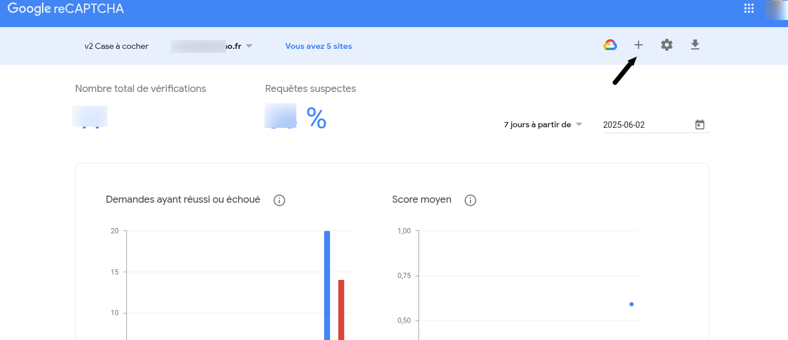
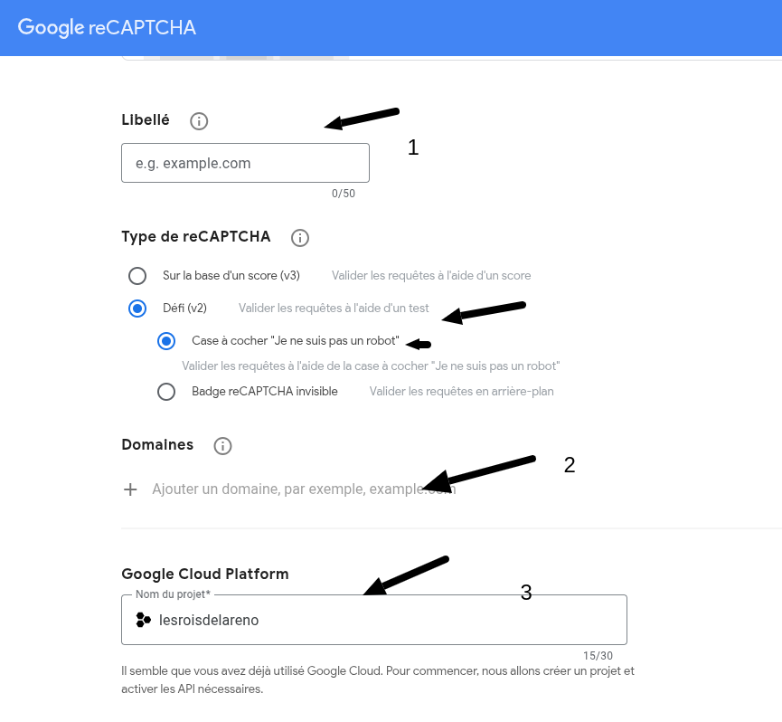

### Configuration de Google reCAPTCHA

La configuration se fait sur : /admin/config/people/captcha/recaptcha

Acceder à cette adresse afin de creer la clée :  
[Ajout de google reCAPTCHA](https://www.google.com/recaptcha/admin)

Ensuite, vous devez remplir ce formulaire :  

- 1 : le nom de votre api
- 2 : Le domaine, par example wb-horizon.com
- 3 : selectionner un projet.
