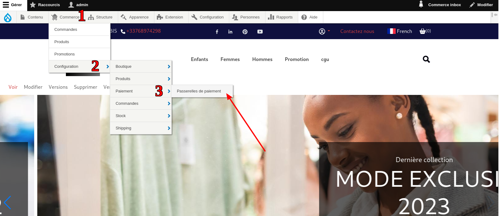
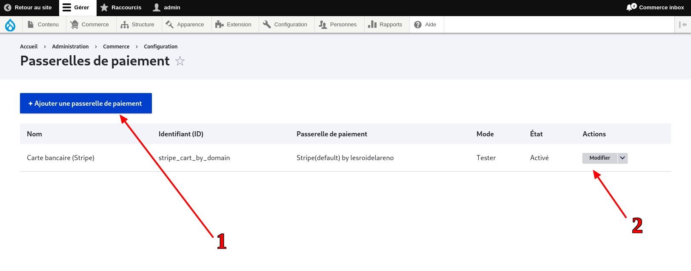
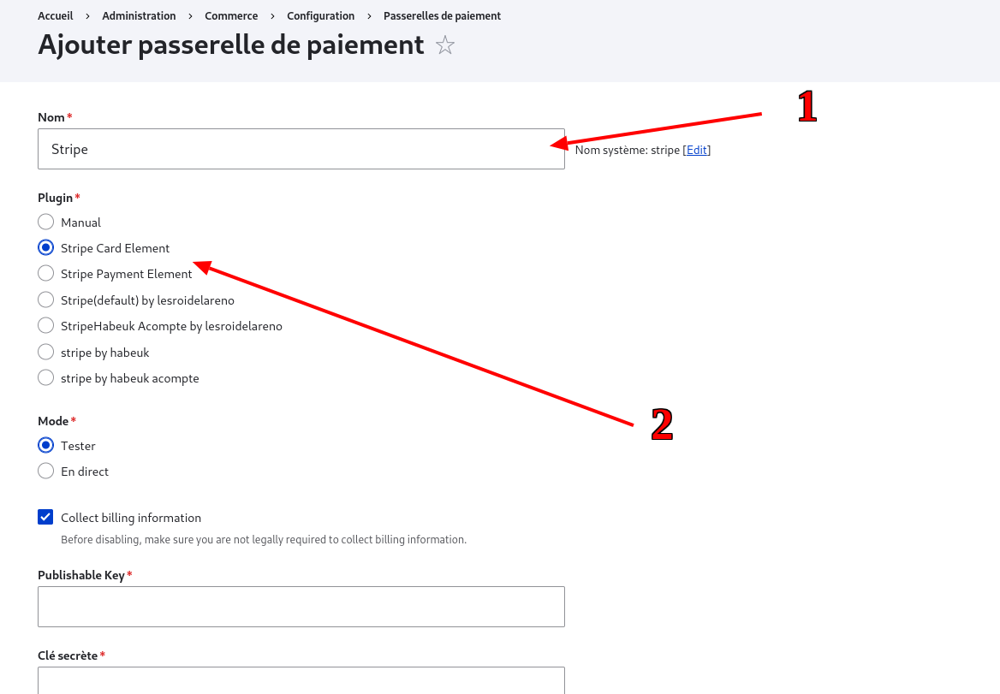

# Comment configurer vos moyens de paiement après avoir importé votre site

## Étapes pour la configuration des moyens de paiement

### 1. Connexion en tant qu'administrateur

Connectez-vous en tant qu'administrateur sur votre site.

### 2. Accès à la configuration des passerelles de paiement

Accédez à la configuration des passerelles de paiement en naviguant dans :
`Commerce > Configuration > Paiement > Passerelles de paiement`.
Suivez les indications fournies dans la capture d'écran ci-dessous.

### 3. Ajout d'une passerelle de paiement

Pour ajouter un moyen de paiement, cliquez sur le bouton "Ajouter une passerelle de paiement" (**1**). 
Pour modifier un moyen de paiement, cliquez sur le bouton "modifier" de celui ci (**2**).

### 4. Remplissage du formulaire

Dans le formulaire qui se présente à vous :

- Entrez un nom pour votre configuration.

- Choisissez "Stripe Card Element" dans la zone _plugin_. Cela fera apparaître d'autres champs nécessaires à la configuration.

### 5. Configuration des champs supplémentaires

Pour le remplissage des autres champs, veuillez vous référer aux tutoriels suivant :

- [Documentation stripe](/docs/moyens-de-paiments/stripe/login.html)
- [Configurer vos moyens de paiement](/docs/moyens-de-paiments/stripe/site-confightml#renseignement-des-cles-api-stripe-sur-wb-horizon)
