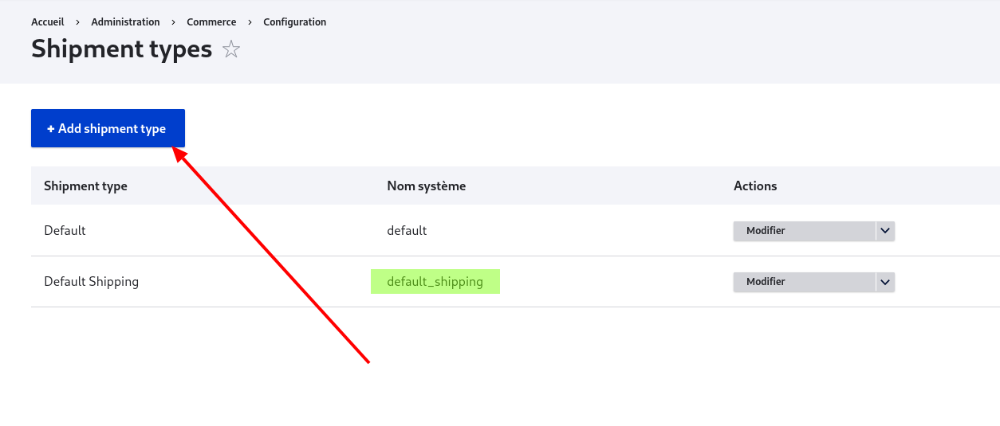
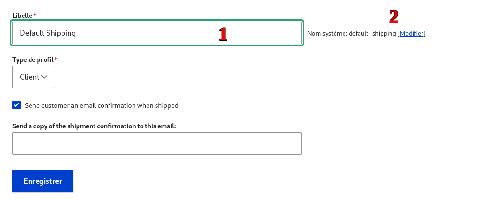
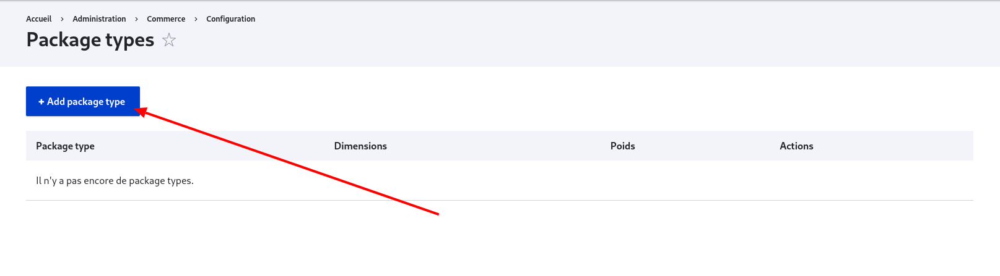
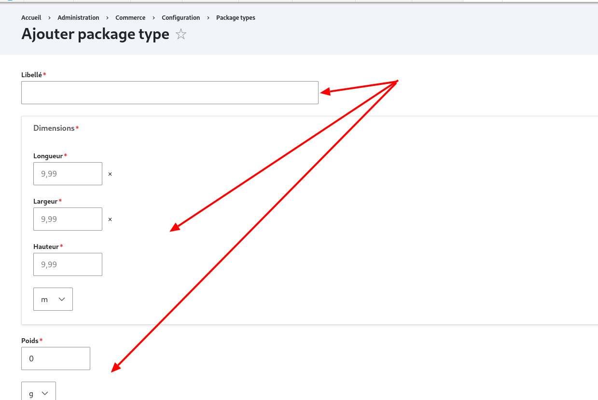
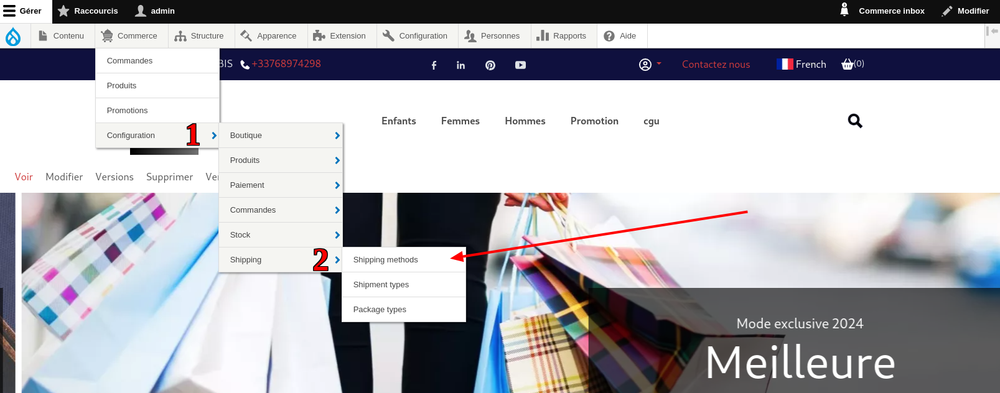
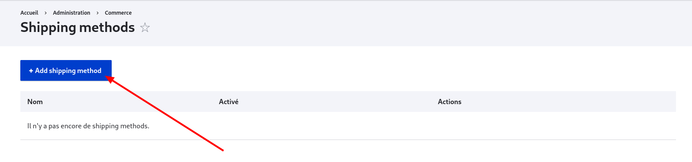
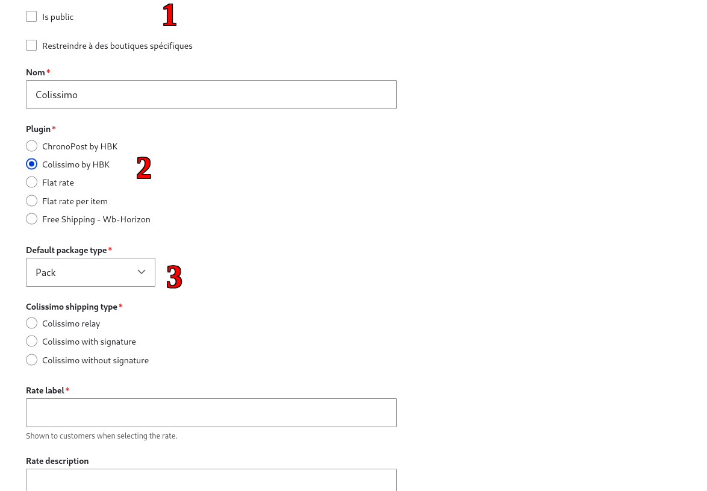

# Comment configurer vos moyens de paiement après avoir importé votre site

> [**Note :**](https://www.bing.com/search?form=SKPBOT&q=Note%20%3A) Ce tutoriel explique comment accéder aux paramètres de livraison dans un site qui n'est plus lié à _wb-horizon_ et donne quelques astuces de dépannage. Pour savoir comment remplir les champs qui ne seront pas mentionnés dans ce tutoriel, référez-vous au tutoriel [Configurer les modes de livraison](/docs/hbkcolissimochrono/configuration-de-base.html#configurationns-de-base).

## Connexion en tant qu'administrateur

Connectez-vous en tant qu'administrateur sur votre site.

## Astuces et dépannage

### Vérifier la présence du type de livraison _default_shipping_

- Accédez à la configuration des modes de livraison : `Commerce > Configuration > Livraison > Shipment types`.

- Si vous n'avez pas "default_shipping" dans la colonne "Nom Système", cliquez sur "+Add shipment Type".
  

- Entrez "Default Shipping" dans le champ "Libellé", ce qui mettra automatiquement "default_shipping" dans la zone du nom système.
  

- Cliquez sur Sauvegarder.

### Ajouter un package type

- Accédez à `Commerce > Configuration > Livraison > Package type`.

- Cliquez sur "+Add package type".
  

- Entrez un libellé, par exemple "pack".

- Entrez les dimensions max pour chaque champ du formulaire, en sélectionnant les bonnes unités.
  

- Cliquez sur enregistrer.

## Configurer l'API de login

- Accédez à `Configuration > Système > hbkcolissimo chrono` comme indiqué dans la capture ci-dessous.

## Ajouter des modes d'expédition

- Accédez à `Commerce > Configuration > Livraison > Modes d'expédition`.
  

- Pour ajouter un mode de livraison, cliquez sur "+ Add shipping method".
  

- Dans le formulaire
  
  - 1: Le champ public est à ignorer
  - 2: choisissez "ChronoPost by HBK" pour un mode de livraison Chronopost, ou "Colissimo by HBK" pour un mode de livraison Colissimo. Cela fera apparaître d'autres champs.
  - 3: Dans le champ "Default package type", sélectionnez le bon package type (par exemple, le "pack" que nous avons créé plus haut).

Pour le reste, référez-vous au tutoriel [Configurer les modes de livraison](/docs/hbkcolissimochrono/configuration-de-base.html#configurationns-de-base).
