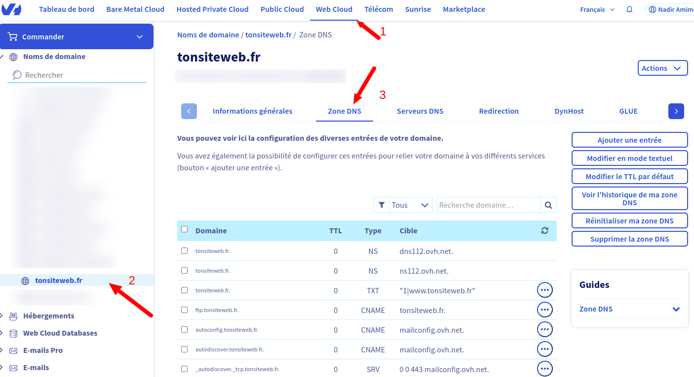
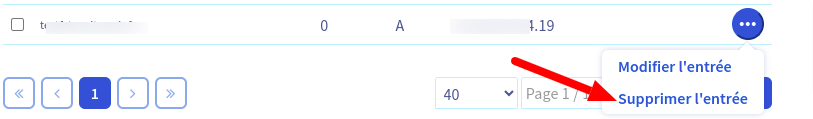
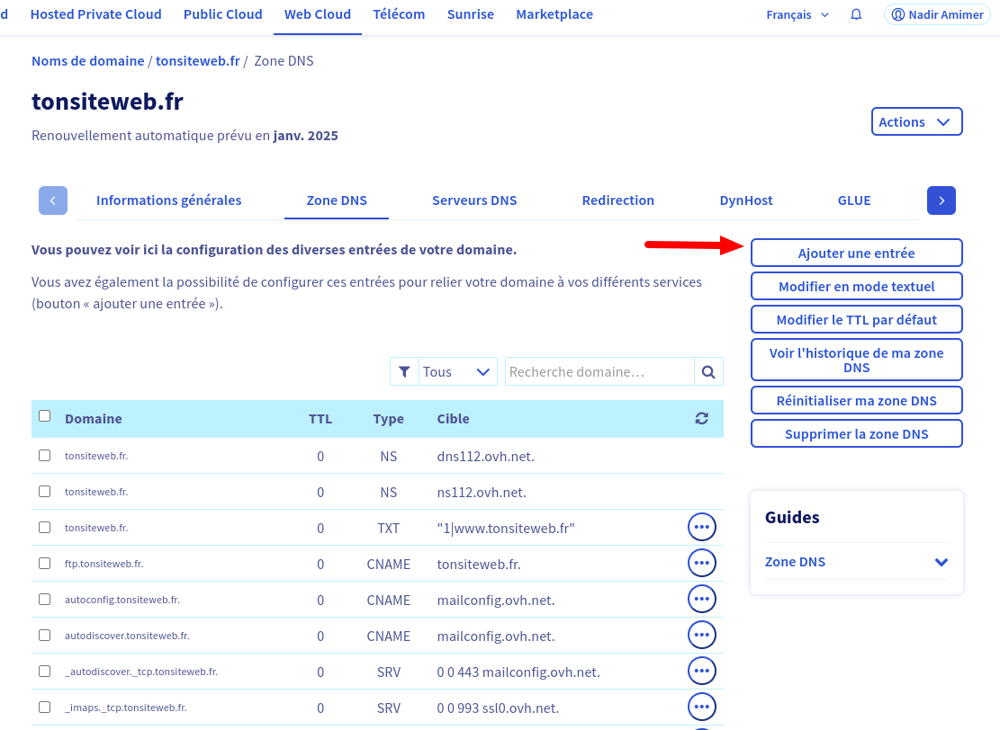
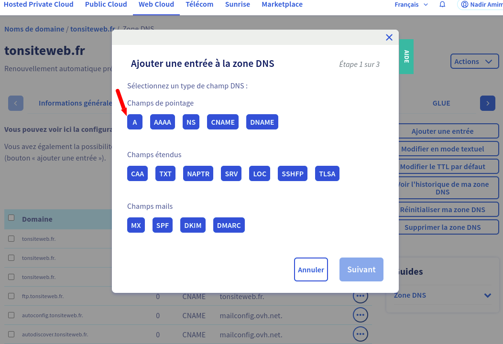
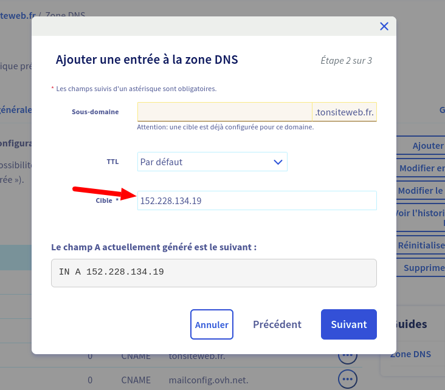
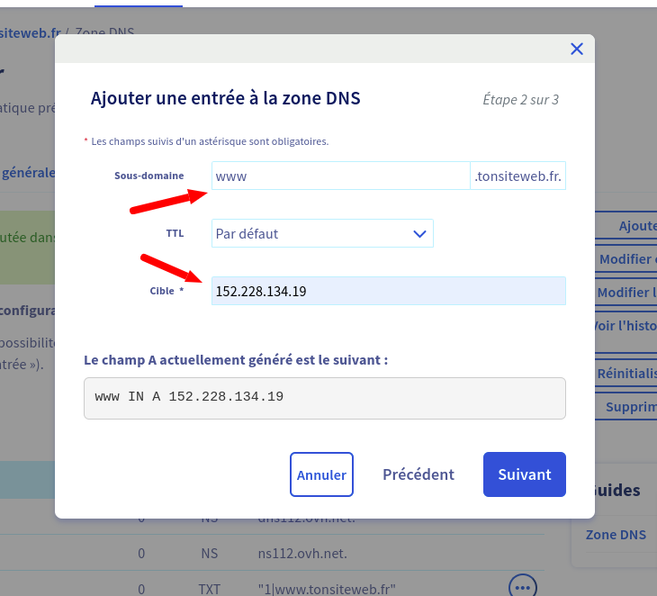

# Association de domaines

Vous avez generer un site web, ce dernier est accessible à travers un sous domaine, par example tonsiteweb-2.wb-horizon.com. Vous souhaitez acceder à ce dernier via un domain, par example tonsiteweb.com.
Vous avez deux possibilités :

<ol>
  <li> Acheté le domaine directement chez wb-horizon</li>
  <li> Acheté le domain chez un register et le faire pointer sur votre site </li>
</ol>

## Acheté le domaine directement chez wb-horizon

Cette approche est entierement automatique

## Acheté le domain chez un register et le faire pointer sur votre site

Cette approche est egalement valide pour ceux qui possede deja un domaine.

##### Explication de la proceduire

Vous devez ajouter un enregistrement DNS de type A avec pour IP 152.228.134.19 au niveau de votre hebegeur afin que votre domain puisse pointer sur votre site web. vous devez egalment le faire pour le sous domaine www.  
Vous devez supprimer les enregistrement en AAAA pour ivp6

##### Cas pratique avec le register OVH

Vous disposez d'un domaine chez OVH.  
Connectez vous sur OVH et suivez les etapes ci-apres :

<ul>
  <li>1 - Cliquez sur web-cloud</li>
  <li>2 - Cliquez sur votre domaine</li>
  <li>3 - Cliquer sur Zone DNS</li>
</ul>

</img>

La figure ci-dessous est dedié à la gestion des enregistrements DNS. 
Verifier et supprimer les enregistrements de Type A et AAAA (voir le colone TYPE ).
</img>

###### Ajouter l'enregitrement pour le domaine

Cliquez sur "Ajouter une entrée" :
</img>

Cliquez sur "A" :
</img>

Ajouter <b>152.228.134.19</b> dans le champs <b>cible</b> :
</img>

Ensuite, cliquez sur suivant et validez.

###### Ajouter l'enregitrement pour le sous domaine (www)

Cliquez sur "Ajouter une entrée".  
Cliquez sur "A".  
Ajouter <b>www</b> dans le champs <b>sous domaine</b> : 
Ajouter <b>152.228.134.19</b> dans le champs <b>cible</b> :
</img>
Ensuite, cliquez sur suivant et validez.
