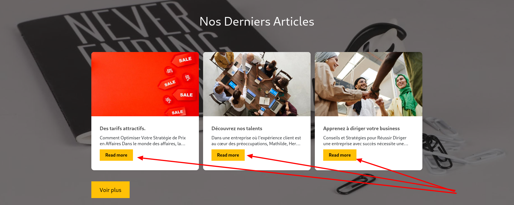
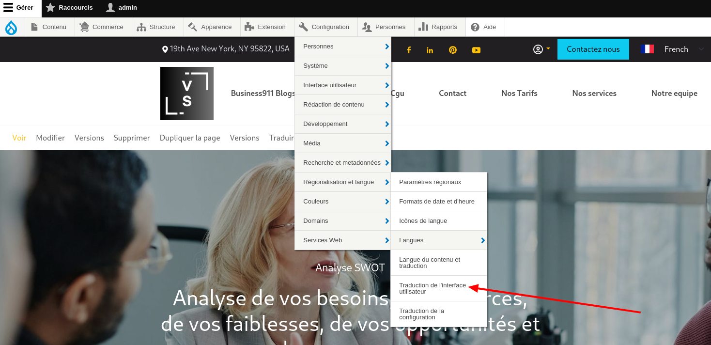
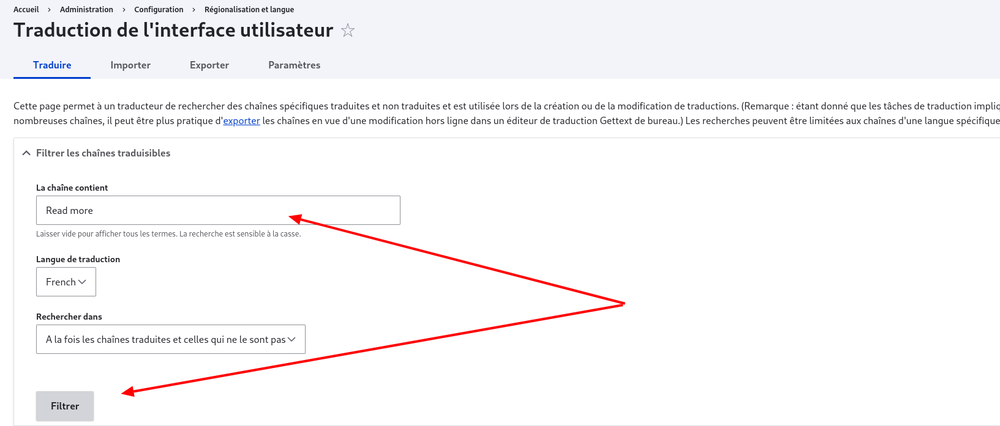
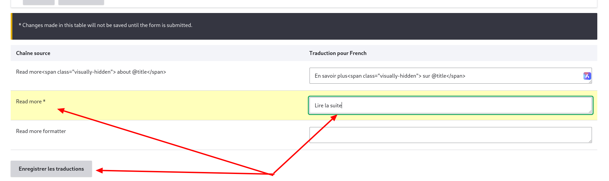
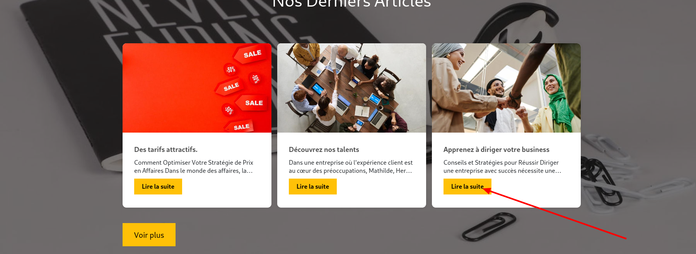
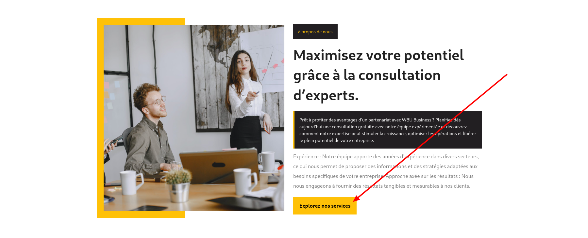
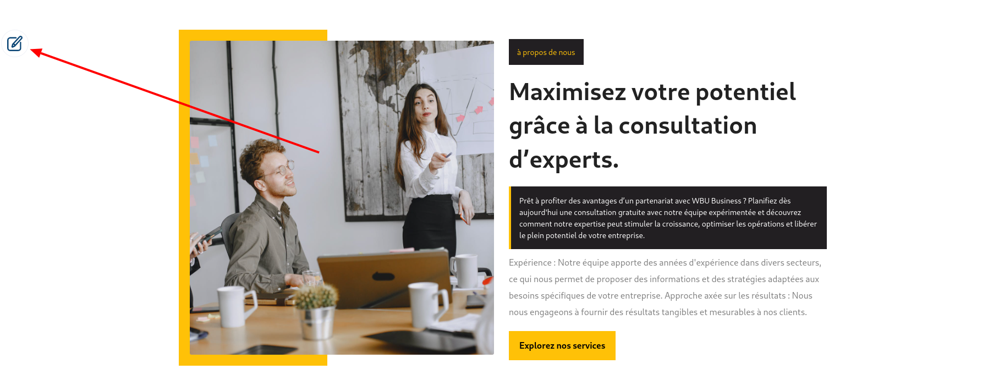
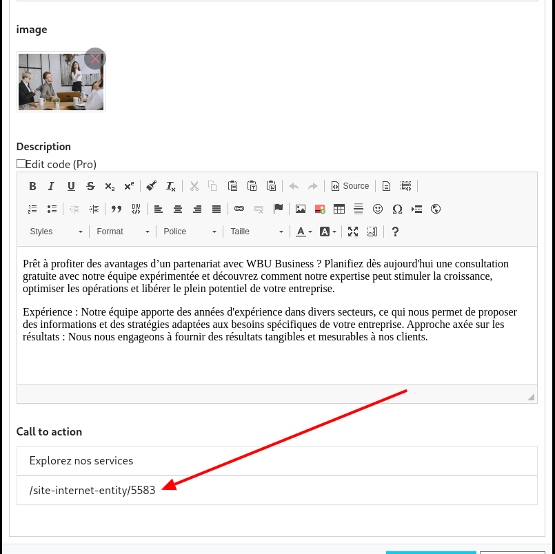

# Configuration après installation du site

Après l'installation de votre site vous pouvez avoir besoin d'éffectuer quelques modifications pour maintenir une certaines cohérences dans vos données.
ici nous allons voir comment effectuer certaines de ces modifications

## Configurer les traductions des configurations

Comme vous pouvez le voir dans la capture ci-dessus, le text pour accéder au contenu est en anglais (il a gardé sa valeur par defaut) hors sur le site d'origine,
ce texte était en français. Celà est du au fait que la traduction de cette entrée a été définie sur le site d'origine et il faut la redéfinir sur notre site une fois exporté.
Pour reconfigurer cela sur votre site, suivez les étapes ci-dessous

- Accédez à la page de configuration de traduction de l'interface utilisateur. (_COnfiguration>Régionalisation et langue>Traduction de l'interface utilisateur_)
  
- Dans le formulaire qui se présente à vous, utilisez le champ **La chaîne contient** pour rechercher la configuration que vous souhaitez traduire et validez le formulaire en cliquant sur le bouton **filter**. Dans notre cas nous recherchons "**Read more**"(cette recherche est sensible à la casse c'est-à-dire qu'il faut respecter les majuscules et les minuscules)
  
- Dans le resultat de la recherche, vous verrez dans la colonne **Chaîne source** la chaine que vous recherchez (sauf s'il ne s'agit pas d'une configuration auquel cas vous n'obtiendez pas de résultat). Entrez la traduction à afficher dans le champ text à côté de votre chaine comme indiqué dans la capture ci dessous avec **Read more** => **Lire la suite** puis cliquez sur **Enregistrer les traductions**
  
- Vous pouvez vérifier que les modifications ont bien été prises en compte
  

## Configurer les liens pour qu'ils puissent pointer sur les bonnes pages

Étant donné que les liens/boutons qui sont ajouté dans les sections de votre site ne sont par defaut pas liés à une page de manière explicite, il est necessaire de configurer la page cible manuellement après l'installation de votre site.
Le lien dans la capture ci-dessous en est un exemple:

Pour le mettre à jour il faut procédé comme indiqué ci-dessous:

- Ouvrez le formulaire d'édition du paragraphe en utilisant le crayon
  
- Retrouvez le champ qui représente le bouton et mettez le à jour. Dans notre cas, nous avons renseigné **/site-internet-entity/5583** qui est l'url d'origine de notre page **Nos Services** puis enregistrez vos modifications.
    
 
    Les urls à utiliser pour les pages internes sont sous la forme **/site-internet-entity/{id de la page}**
    Pour récupérer l'id d'une page, il vous suffit d'accéder à cette page, cliquer sur le bouton modifier juste endessous du menu et dans l'url de la page résultante, récupérer le nombre juste avant **/edit**. Ce nombre est l'id de votre page.  
    

    NB: Utiliser cette url au lieu de l'alias permet de prevenir les liens qui pointent vers des pages inexistantes. Si l'on utilise un alias et que pour une raison ou une autre le titre de la page que nous reférençons vient à être changé, alors son alias changera aussi et notre lien ne sera plus valide or en utilisant ce lien lorsque l'on renseigne le champ, on pointera toujours vers la bonne page. Bien que l'url que nous entrons ait une forme peu comprehensible par l'homme dans la configuration, au survole il affichera toujours l'alias si celui ci existe
  
