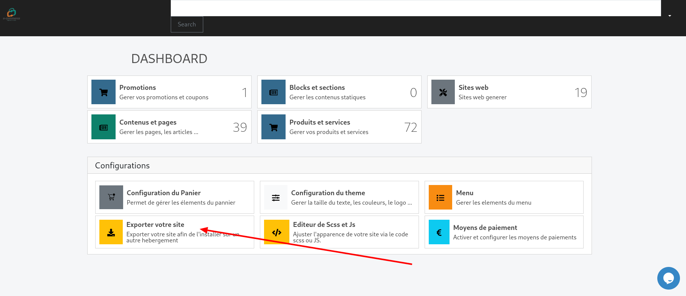
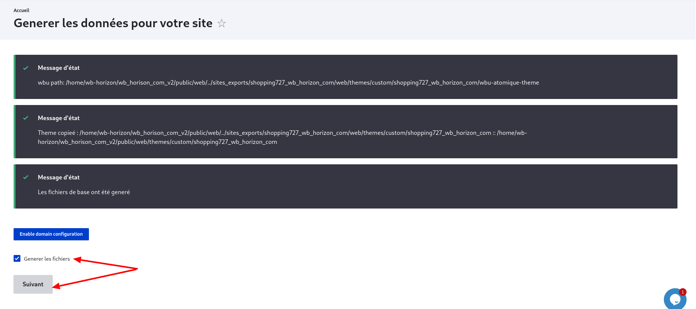
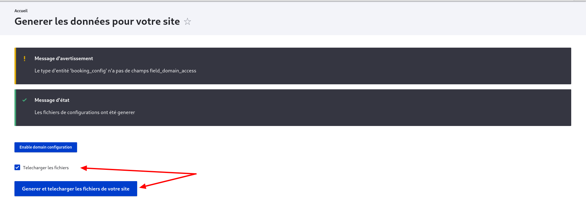
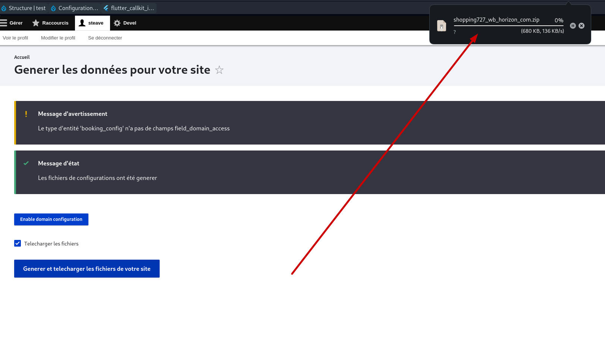

# Exporter votre site

## Étape 1 : Connexion

Connectez-vous en tant qu'administrateur ou propriétaire du site.

## Étape 2 : Accéder au Dashboard

Accédez à votre dashboard puis cliquez sur **"Exporter votre site"**. Si c'est la première fois que vous le faites, cela peut prendre un certain temps.

## Étape 3 : Générer les données de votre site

Dans la page suivante (**Générer les données de votre site**), assurez-vous que **"Générer les fichiers"** soit coché. Cela aura pour effet de réécrire les configurations dont votre site aura besoin pour être installé sur votre serveur.

Ensuite, cliquez sur **"Suivant"**.

## Étape 4 : Télécharger les fichiers

Vous voici à présent dans la dernière partie de l'export de votre site. Assurez-vous que **"Télécharger les fichiers"** soit coché et cliquez sur **"Générer et télécharger les fichiers de votre site"**.

Patientez quelques instants et une version compressée des fichiers de votre site (configurations, modules, thèmes) sera téléchargée. **NB : Ne quittez pas la page avant que le téléchargement ne vous soit proposé.**

## Étape 5 : Installation sur le serveur

Une fois le téléchargement du fichier ZIP terminé, il ne vous restera qu'à le mettre sur votre serveur et faire les configurations nécessaires pour que le bon domaine pointe vers lui.

---
