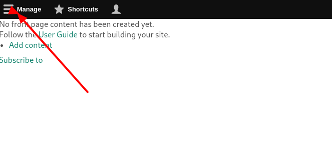
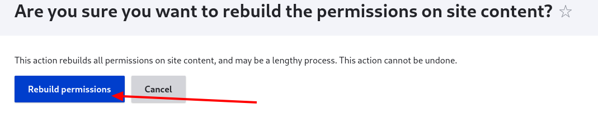
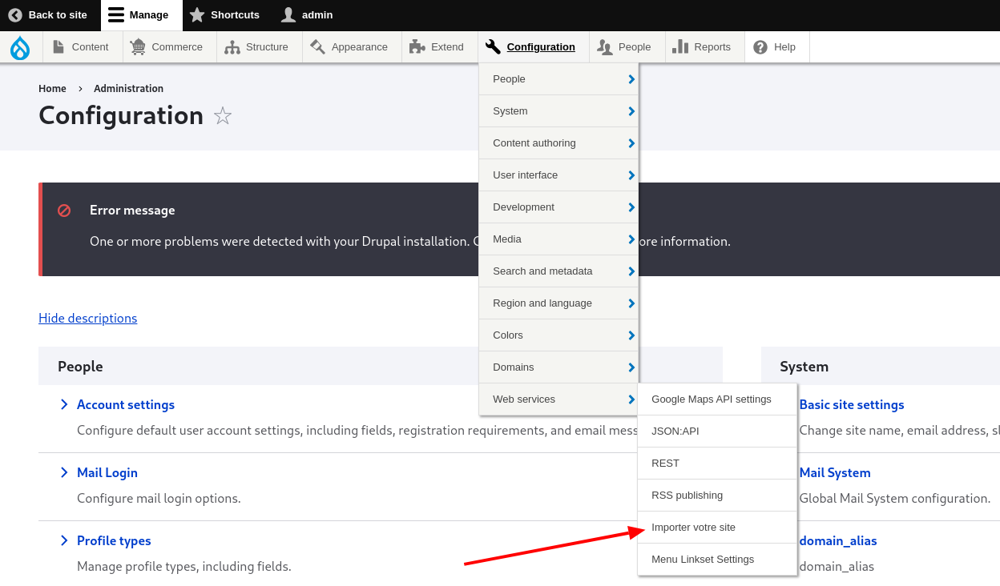
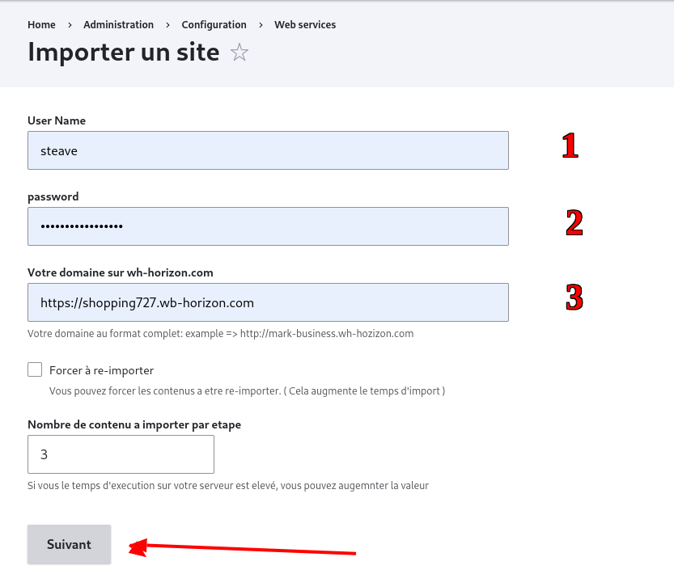
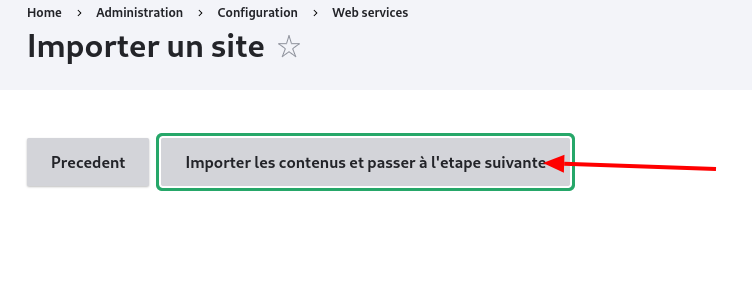
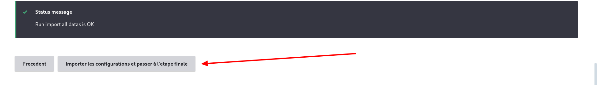

# Effectuer un import

## 1. Connexion en tant qu'administrateur

Après avoir installé votre site, vous êtes redirigé vers une page vide. Connectez-vous en tant qu'administrateur.

## 2. Reconstruction des permissions

1. Cliquez sur **Manage**.
   

2. Reconstruisez les permissions en cliquant sur **Rebuild permissions**.
   
3. Validez la reconstruction des permissions.
   

## 3. Lancer l'import

1. Une fois la reconstruction terminée, accédez à **Configuration > Web services > Importer votre site**.
   
2. Remplissez le formulaire comme suit :
   
   • **1. Nom d'utilisateur du propriétaire du site sur wb-horizon**

   • **2. Mot de passe du propriétaire du site sur wb-horizon**

   • **3. Domaine sur wb-horizon** (il est important de respecter la structure de l'exemple fourni juste en dessous du champ)

3. Cliquez sur **Suivant**.
   
4. Cliquez sur **Importer les contenus** et patientez la fin de l'import des contenus (ne fermez pas cet onglet).
   
5. Ensuite, cliquez sur **Importer les configurations et passer à l'étape finale**.
6. Reproduisez l'étape précédente.

## 4. Finalisation

Dans la page qui suit (Régénérer votre thème), cliquez sur **Terminer le processus**.
