# Installer votre site sur votre serveur

## Configurer votre environnement

### 1 : sur un autre domaine sur OVH

#### Acheter un domaine

1. Ouvrez votre navigateur et allez sur [**Web Hosting & Domain**](https://www.ovhcloud.com/en-ie/web-cloud/).

2. **Recherchez le domaine que vous souhaitez acheter** :
   

   • Utilisez la barre de recherche pour vérifier la disponibilité du domaine souhaité.

   • Si le domaine est disponible, ajoutez-le à votre panier.

3. **Ajoutez-le à votre panier et suivez les instructions pour finaliser l'achat** :

   • Cliquez sur "Commander".

   • Suivez les étapes pour créer un compte ou vous connecter si vous en avez déjà un.

   • Complétez les informations nécessaires et effectuez le paiement.

#### Obtenir un hébergement

1. **Sur le site d'OVH, allez dans la section "Hébergement web et domaine > Hébergement web"** :

   • Connectez-vous à votre compte OVH.

   • Naviguez vers la section "Hébergement web et domaine" puis "Hébergement web".
   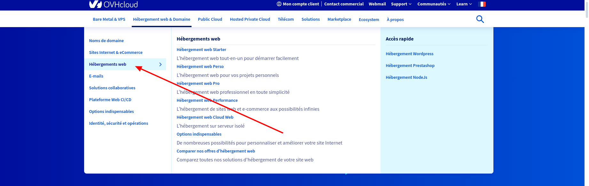

2. **Choisissez un plan d'hébergement adapté à vos besoins** :
   • Comparez les différents plans proposés (Perso, Pro, Performance, etc.).
   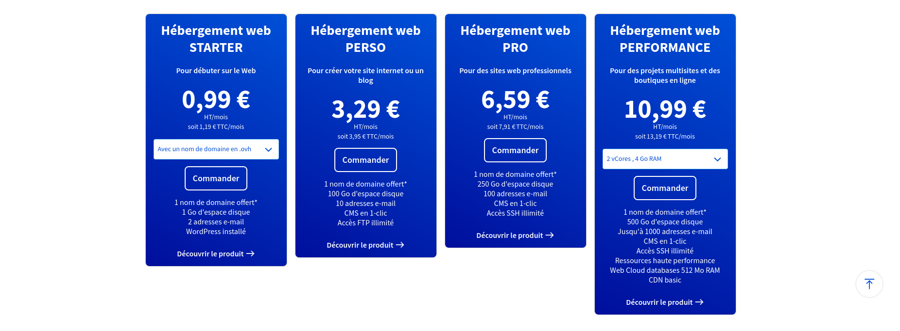

• Sélectionnez celui qui correspond le mieux à vos besoins en termes de stockage, de trafic, et de fonctionnalités.

3. **Ajoutez-le à votre panier et suivez les instructions pour finaliser l'achat** :
   • Cliquez sur "Commander".

• Suivez les étapes pour créer un compte ou vous connecter si vous en avez déjà un.

• Complétez les informations nécessaires et effectuez le paiement.

#### Définir le répertoire racine du site

1. [**Connectez-vous à votre espace client OVH**](https://www.bing.com/search?form=SKPBOT&q=Connectez-vous%20%C3%A0%20votre%20espace%20client%20OVH) :
   • Utilisez vos identifiants pour vous connecter à [l'espace client OVH](https://www.ovh.com/manager/).

2. [**Allez dans la section "Hébergement"**](https://www.bing.com/search?form=SKPBOT&q=Allez%20dans%20la%20section%20%26quot%3BH%C3%A9bergement%26quot%3B) :
   • Dans le menu de gauche, cliquez sur "Hébergement".

3. [**Sélectionnez votre hébergement**](https://www.bing.com/search?form=SKPBOT&q=S%C3%A9lectionnez%20votre%20h%C3%A9bergement) :
   • Cliquez sur le nom de votre hébergement pour accéder à ses paramètres.

4. [**Configurer le répertoire racine**](https://www.bing.com/search?form=SKPBOT&q=Configurer%20le%20r%C3%A9pertoire%20racine) :
   • Allez dans l'onglet "Multisite".

• Vous verrez une liste de vos domaines et sous-domaines associés à cet hébergement.

• Cliquez sur l'icône en forme de crayon à côté du domaine ou sous-domaine que vous souhaitez configurer.

• Dans le champ "Répertoire racine", entrez le chemin du répertoire où se trouvent les fichiers de votre site (par exemple, `www`, `public_html`, etc.).

• Cliquez sur "Valider" pour enregistrer les modifications.

#### Téléchargement des fichiers sur le serveur OVH

1. [**Obtenir les informations de connexion FTP**](https://www.bing.com/search?form=SKPBOT&q=Obtenir%20les%20informations%20de%20connexion%20FTP) :
   • Connectez-vous à votre espace client OVH.

• Allez dans la section "Hébergement" puis "FTP - SSH".

• Notez les informations de connexion FTP (hôte, utilisateur, mot de passe).

2. [**Utiliser un client FTP (comme FileZilla)**](https://www.bing.com/search?form=SKPBOT&q=Utiliser%20un%20client%20FTP%20%28comme%20FileZilla%29) :
   • Téléchargez et installez FileZilla.

• Ouvrez FileZilla et entrez les informations de connexion FTP.

• Connectez-vous et transférez les fichiers de votre site dans les répertoires appropriés. [**Assurez-vous que les fichiers respectent la structure définie plus haut lors de la définition de la racine du site**](https://www.bing.com/search?form=SKPBOT&q=Assurez-vous%20que%20les%20fichiers%20respectent%20la%20structure%20d%C3%A9finie%20plus%20haut%20lors%20de%20la%20d%C3%A9finition%20de%20la%20racine%20du%20site).

3. [**Obtenir les informations de connexion SSH**](https://www.bing.com/search?form=SKPBOT&q=Obtenir%20les%20informations%20de%20connexion%20SSH) (si nécessaire) :
   • Connectez-vous à votre espace client OVH.

• Allez dans la section "Hébergement" puis "FTP - SSH".

• Notez les informations de connexion SSH (hôte, utilisateur, mot de passe).

• Utilisez un client SSH (comme PuTTY) pour vous connecter à votre serveur.

4. [**Mettez à jour les fichiers de configuration pour qu'ils pointent vers la base de données que vous avez créée**](https://www.bing.com/search?form=SKPBOT&q=Mettez%20%C3%A0%20jour%20les%20fichiers%20de%20configuration%20pour%20qu%26apos%3Bils%20pointent%20vers%20la%20base%20de%20donn%C3%A9es%20que%20vous%20avez%20cr%C3%A9%C3%A9e) :
   • Ouvrez les fichiers de configuration (souvent nommés `config.php`, `settings.php`, etc.).

• Modifiez les paramètres de connexion à la base de données avec les informations que vous avez notées précédemment (nom de la base, utilisateur, mot de passe, serveur).

### sur lesroisdelareno

#### 1. Configuration d'OVH

1. Connectez-vous sur OVH avec le compte d'administration.
2. Allez dans [**Web Cloud > Hébergements > lesroisdelareno.fr**](https://www.bing.com/search?form=SKPBOT&q=Web%20Cloud%20%26gt%3B%20H%C3%A9bergements%20%26gt%3B%20lesroisdelareno.fr).
   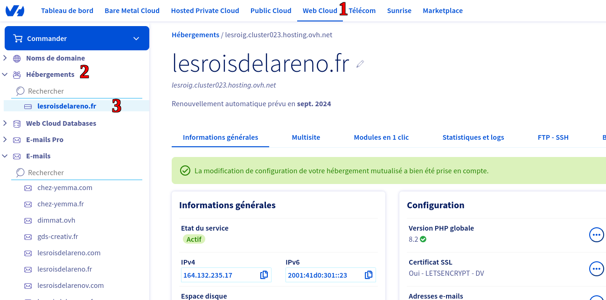

3. Allez sur l'onglet [**Multisite**](https://www.bing.com/search?form=SKPBOT&q=Multisite).
   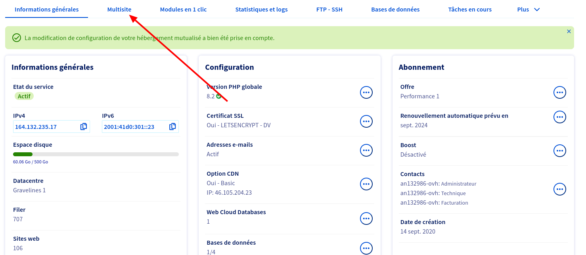

4. Dans le bouton des actions qui apparaît avec le tableau des sites, choisissez [**Ajouter un domaine ou sous-domaine**](https://www.bing.com/search?form=SKPBOT&q=Ajouter%20un%20domaine%20ou%20sous-domaine).
   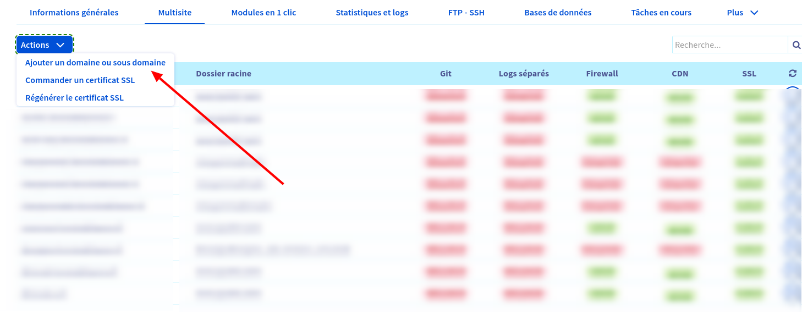

5. Cochez [**Ajouter un domaine enregistré chez OVH**](https://www.bing.com/search?form=SKPBOT&q=Ajouter%20un%20domaine%20enregistr%C3%A9%20chez%20OVH) s'il n'est pas déjà coché et sélectionnez dans la liste [**lesroisdelareno.fr**](https://www.bing.com/search?form=SKPBOT&q=lesroisdelareno.fr).
   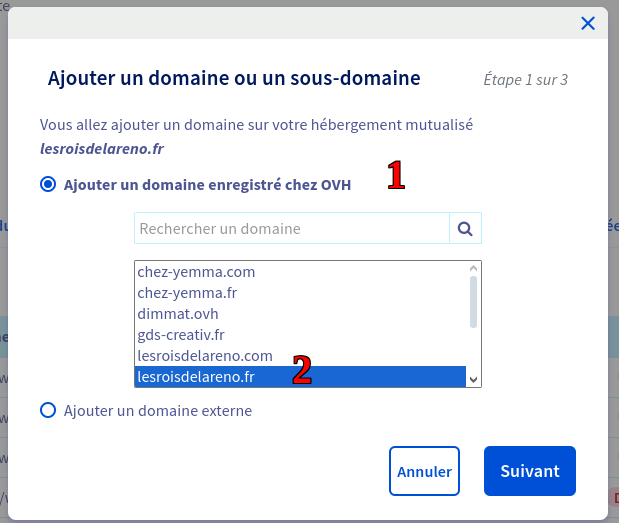

6. Dans le formulaire qui se présente à vous, remplissez le champ [**Sous-domaine**](https://www.bing.com/search?form=SKPBOT&q=Sous-domaine).

7. Dans le champ [**Dossier racine**](https://www.bing.com/search?form=SKPBOT&q=Dossier%20racine), renseignez le répertoire de lancement de votre site. (Pour les sites Drupal, nous utilisons `{id_du_site}/public/web`). Il faudra respecter cette structure de fichier lors de la mise en place de la structure de fichier.

8. Les options ne demandent généralement pas de modifications, mais vous pouvez les modifier à condition de savoir ce que vous faites.
   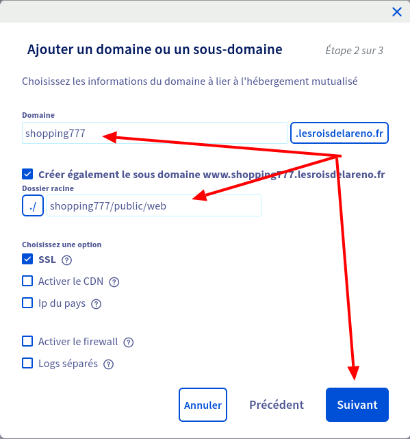

9. Une fois cela fait, cliquez sur [**Suivant**](https://www.bing.com/search?form=SKPBOT&q=Suivant) et vérifiez les informations que vous avez entrées pour votre site. Laissez coché [**Configuration automatique**](https://www.bing.com/search?form=SKPBOT&q=Configuration%20automatique) pour faire pointer le sous-domaine que vous avez mentionné plus haut automatiquement vers le serveur.
   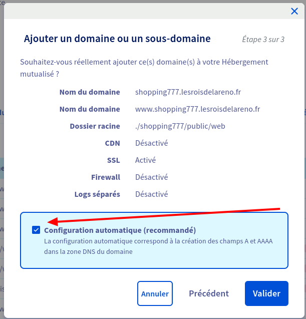

10. Si toutes les informations entrées sont valides, cliquez sur le bouton [**Valider**](https://www.bing.com/search?form=SKPBOT&q=Valider).

#### 2. Mise en place des fichiers sur le serveur

1. Envoyez les fichiers de votre site sur le serveur lesroisdelareno en utilisant un outil tel que FileZilla.
   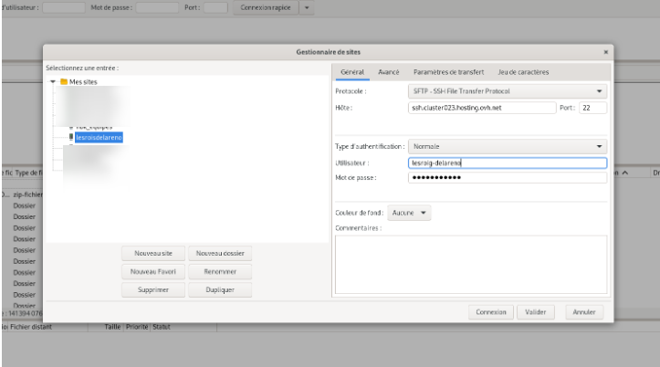

2. Connectez-vous au serveur en utilisant SSH.
3. Créez le répertoire `{id_du_site}` en respectant le nom que vous avez renseigné du côté d'OVH :

```sh
mkdir {id_du_site}
```

1.  Déplacez le fichier zip vers le répertoire que vous venez de créer et mettez-vous dans ce répertoire :

```sh
mv archive_du_site.zip {id_du_site}
```

```sh
cd {id_du_site}
```

1.  Décompressez l'archive du site et renommez le répertoire résultant en public :

```sh
unzip archive_du_site.zip
```

```sh
mv archive_du_site public
```

1.  Assurez-vous que la structure est bonne en saisissant la commande :

```sh
ls ~/{id_du_site}/public/web
```

Si vous avez un résultat sans erreur, alors tout semble avoir fonctionné correctement. Sinon, contactez le service technique.

## Configurer une base de données

1. [**Connectez-vous à votre espace client OVH**](https://www.bing.com/search?form=SKPBOT&q=Connectez-vous%20%C3%A0%20votre%20espace%20client%20OVH) :
   • Utilisez vos identifiants pour vous connecter à [l'espace client OVH](https://www.ovh.com/manager/).

2. [**Allez dans la section "Web Cloud" pour accéder à "Web Cloud Databases"**](https://www.bing.com/search?form=SKPBOT&q=Allez%20dans%20la%20section%20%26quot%3BWeb%20Cloud%26quot%3B%20pour%20acc%C3%A9der%20%C3%A0%20%26quot%3BWeb%20Cloud%20Databases%26quot%3B) :
   • Dans le menu de gauche, cliquez sur "Web Cloud" puis sur "Web Cloud Databases".

3. [**Si vous n'avez pas encore commandé de base de données**](https://www.bing.com/search?form=SKPBOT&q=Si%20vous%20n%26apos%3Bavez%20pas%20encore%20command%C3%A9%20de%20base%20de%20donn%C3%A9es) :
   • Allez dans "Commander", puis "Web Cloud Database".
   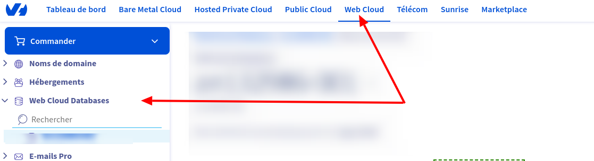

• Suivez les étapes pour choisir le SGBD (MySQL, PostgreSQL, etc.) et le stockage souhaité.

• Complétez les informations nécessaires et effectuez le paiement.

4. [**Si vous avez déjà commandé une base de données**](https://www.bing.com/search?form=SKPBOT&q=Si%20vous%20avez%20d%C3%A9j%C3%A0%20command%C3%A9%20une%20base%20de%20donn%C3%A9es) :
   • Sélectionnez-la dans "Web Cloud Databases".
   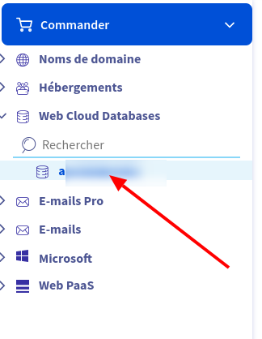

• Allez dans "Bases de données" pour créer et configurer votre base de données :
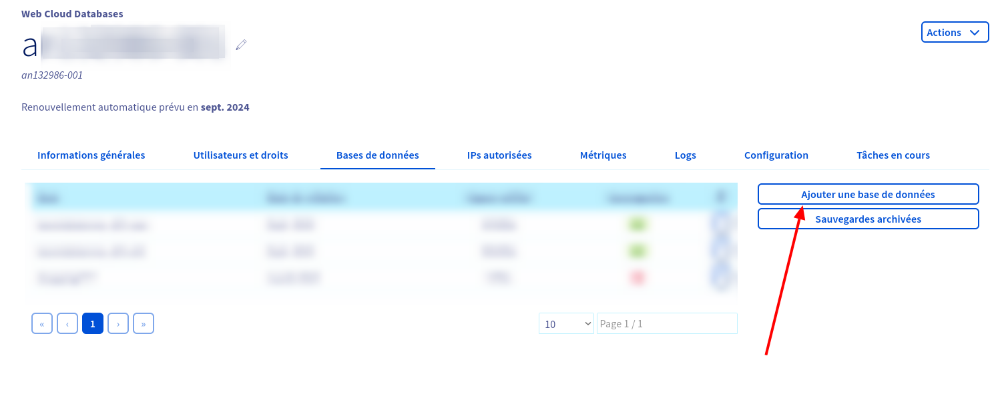

• Cliquez sur "Créer une base de données".
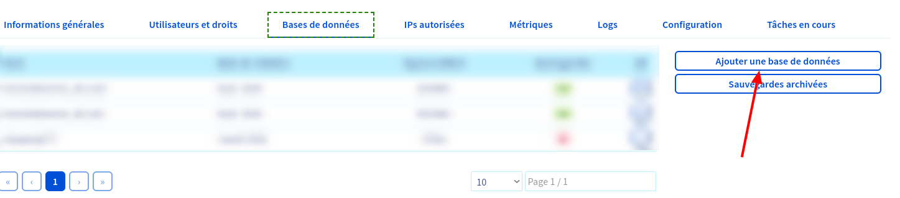

• Remplissez les informations requises (nom de la base, utilisateur, mot de passe).
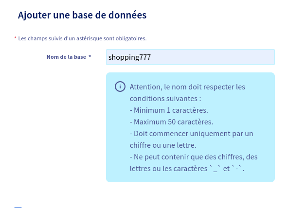
Cochez **Créez un utilisateur** si vous voulez un administrateur particulier pour cette base de données et remplissez les champs qui se presenteront à vous
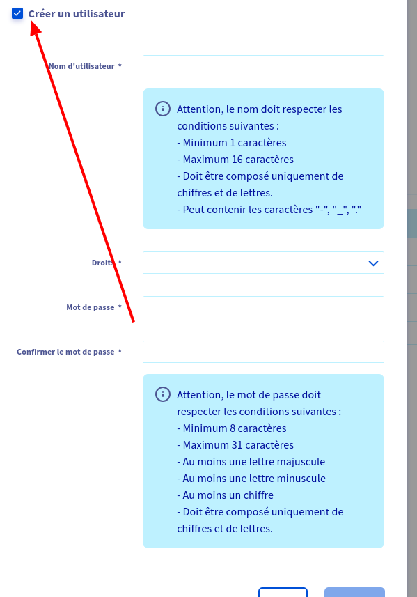

• Cliquez sur "Valider" pour créer la base de données.

5. [**Notez les informations de connexion**](https://www.bing.com/search?form=SKPBOT&q=Notez%20les%20informations%20de%20connexion) :
   • Conservez précieusement le nom de la base de données, l'utilisateur, le mot de passe et le serveur. Ces informations seront nécessaires pour configurer votre site.

## Finaliser l'installation

### Installation de Drupal sur un serveur distant

### 1. Accéder au sous-domaine

Accédez au sous-domaine que vous avez configuré sur OVH (dans notre cas, il s'agit de `shopping727.lesroisdelareno.fr`).

### 2. Configuration de la base de données

Dans la page que vous obtenez, vous devez configurer les informations relatives à la base de données que vous avez créée.

• Si vous n'avez pas créé d'utilisateur ou si vous ne savez pas comment renseigner les champs **Database username** et **Database password**, rendez-vous sur la page de configuration de la base de données et cliquez sur **Gérer les autorisations** pour donner les droits à un utilisateur.
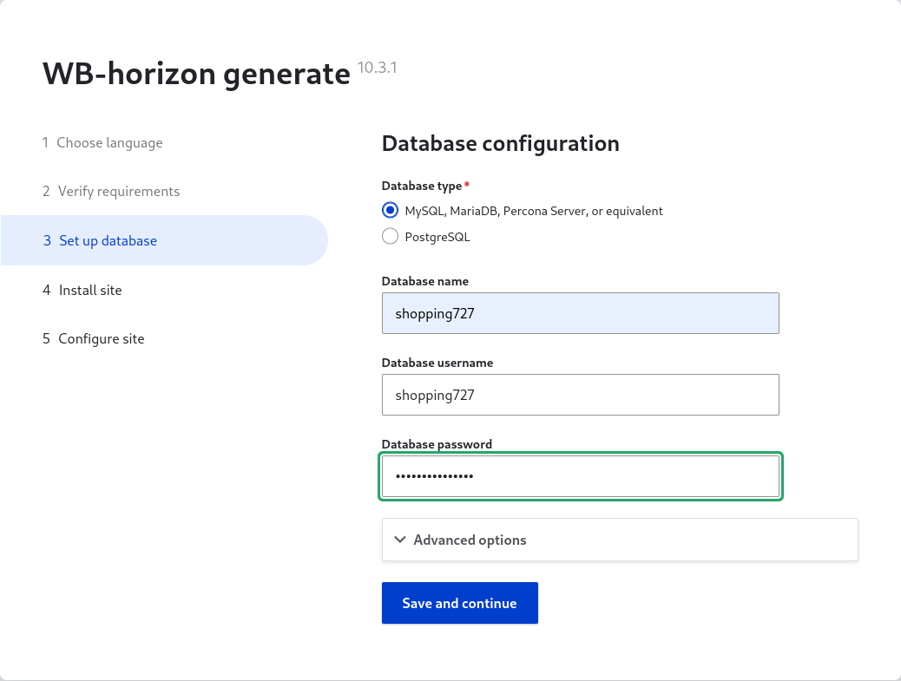

• Déroulez les **Advanced options** et renseignez les champs **Host** et **Port number** Vous pouvez récupérer ces valeurs dans l'onglet **Informations générales** de votre **Web Cloud Databases**.
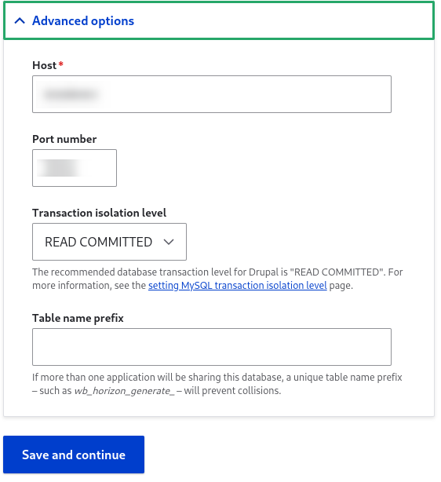
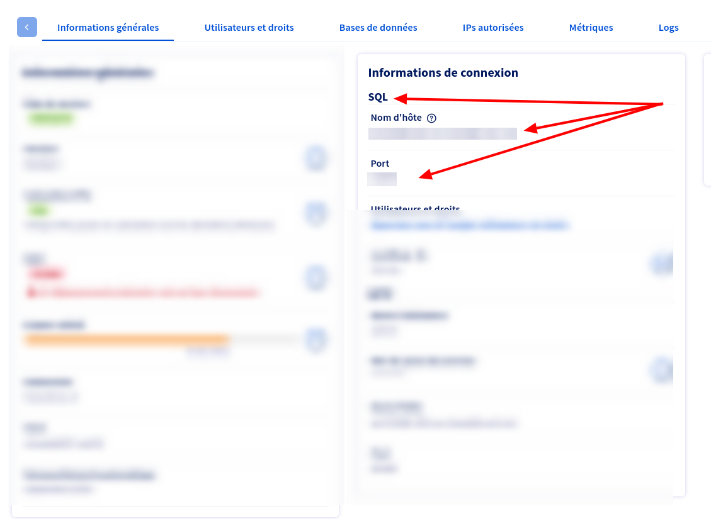

• Validez en cliquant sur **Save and continue**.

### 3. Finalisation de l'installation

Patientez le temps que l'installation se termine, puis dans la page suivante, remplissez le formulaire de configuration de votre site.

---
