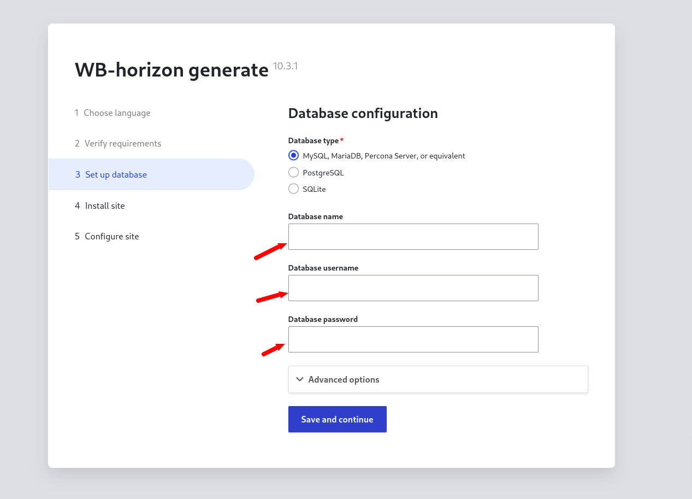
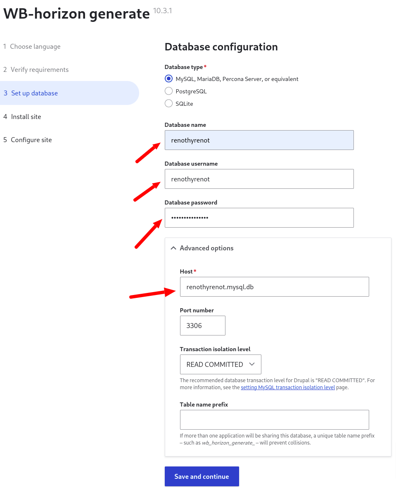
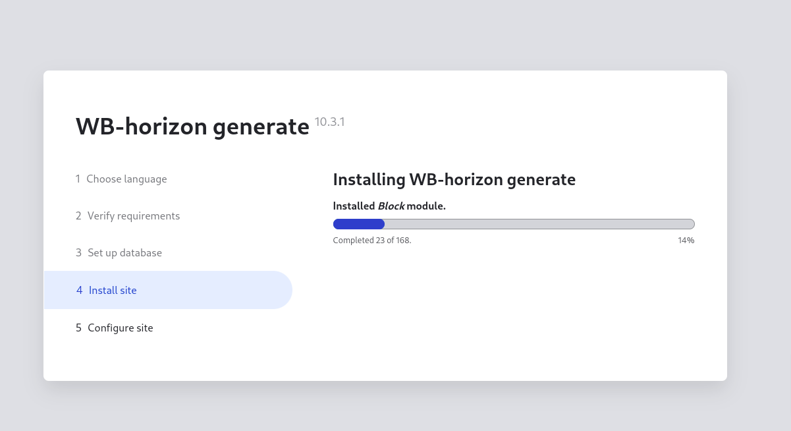
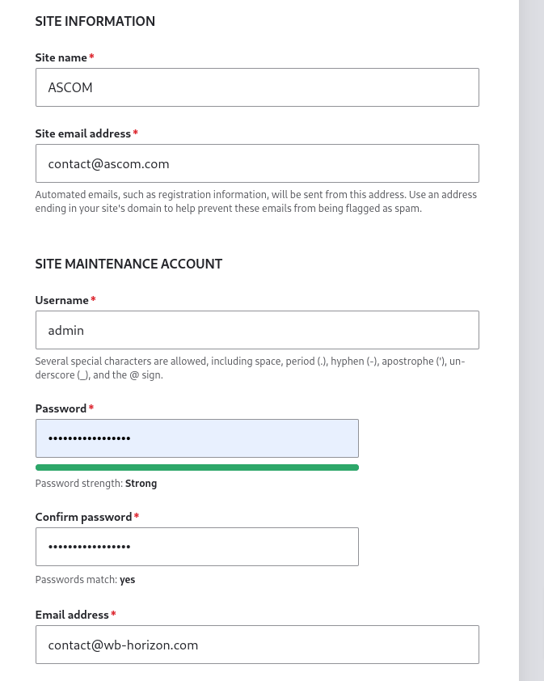
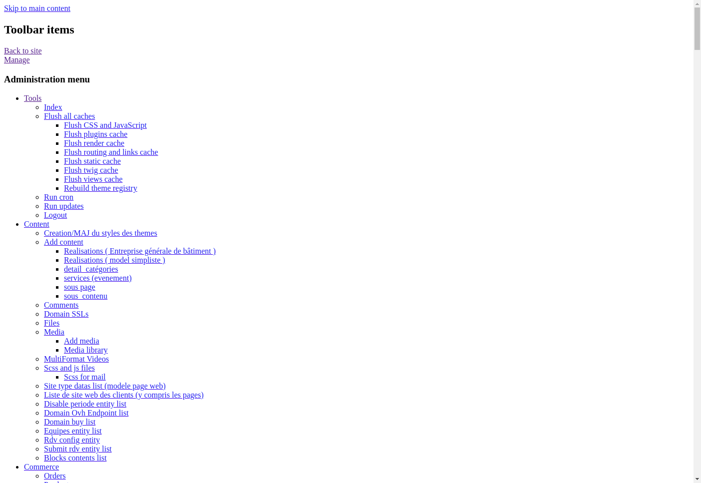

# Transfert des fichiers et installation de base

## Environnement de base

Dans les rubriques precedentes, nous avons deja telecharger les fichiers de notre site. Pour la suite vous devez acheter ou nom de domaine et un espace d'espace d'hebergement.

### Configuration requise :

- PHP >= 8.3
- Mysql ~ 8 | MariaDB >= 10.11.0
- Espace disque > 5Go
- RAM >= 512 Mo

#### Définir le répertoire racine du site

1. **Connectez-vous à votre espace client OVH**:
   Utilisez vos identifiants pour vous connecter à [l'espace client OVH](https://www.ovh.com/manager/).

2. **Cliquez sur "web cloud"** :
   Dans le menu de gauche, derouller "Hébergement". Cliquer sur votre nom de domaine.


à ce stade, nous sommes deja sur notre espace d'hebergement, nous devons verifier et ajuster certains paramettres.

- **1/3 Verification de la version active de PHP** : Au niveau des pre-requis il est recommandé d'avoir au minimun php 8.3.
  Cliquez sur les 3 points dans le cercle et cliquez sur "modifier la configuration" :
  
  ensuite :

* selectionner "Modifier la configuration courante" et cliquez sur "suivant".
* selectionner la version 8.3 et cliquez sur "valider".
  

Vous devez patienter quelques minutes avant que cela ne prenne effet. <br>

- **2/3 Modification du dossier racine** : Cette etape permet de dire au serveur au se trouve le fichier index.php. :)
  Nous devons modifier le domaine et le premier sous domaine (www.); ainsi que la racine.

  
  Modification du domaine principal : Cliquez sur les 3 points dans le cercle, ensuite sur "modifier le domaine".
  
  Ensuite, dans le champ racine remplacer **"www"** par le nom de domaine de votre site suivis de web.

  **Ex**: Pour le site **renothermique.com** nous aurons **renothermique/web**. Si vous n'avez pas encore mis en place la structure de fichier, le repertoire **renothermique/web** sera automatiquement créé.
    <div class="alert alert-primary border-info border-right-0 border-top-0 border-bottom-0" role="alert">
    <span class="font-weight-bold text-decoration-underline">NOTE:</span>
    Si vous souhaitez installer plusieurs site sur le même hebergement vous pouvez ajouter un reportoire à la racine (**./**).
    Par exemple si vous ajoutez un site de batiment.com vous pourrez le mettre dans le repertoire **batiment/web** à la racine(**./**) 
  </div>
  

  Ensuite : Cliquez sur suivant et sur "valider".
  NB: Reprennez la meme proceduire pour le premier sous domaine, i.e celui commencant par "www." <br>
  à la fin vous devez optenir ceci :
  

- **3/3 Mise en place de la base de donnée** : cliquez sur "action" ensuite "creer une base de données".
<div class="alert alert-warning"> NB: vous devez retenir le mot de passe et le nom d'utilisateur, car vous aurriez besoin de ces informations pour la suite. </div>


Une fois ces etapes terminer patientez quelques minute, vous devez obtenir ceci :

<div class="alert alert-warning"> Les informations avec les fleches dessus sont tres importante pour la suite. </div>
Sur ceux, nous sommes arrives au bout de cette premier partie :). Notre espace d'hegement est enfin pret pour accueillir un site generer par wbhorison.

## Transfert des fichiers sur le serveur OVH

**1/3 : Obtenir les informations de connexion FTP**:
• Connectez-vous à votre espace client OVH.
• Allez dans la section "Hébergement" puis "FTP - SSH".
• Notez les informations de connexion FTP (hôte, utilisateur, mot de passe).

**2/3 : Utiliser un client FTP (comme FileZilla)**:
• Téléchargez et installez FileZilla.
• Ouvrez FileZilla et entrez les informations de connexion FTP.

**3/3 : Transfert des fichiers**:
Pour le transfert, nous allons vous proposez 2 approche :<br>

### Methode 1 : pour debutant <br>

- **Decompresser les fichiers**: Le fichier telecharger lors des etapes precedante se termine par "...wb_horizon_com.zip". Dézipper ce fichier, à partir de fillezilla,

- **Mise en place de la struture préconfiguré sur ovh**.<br>
  Copier le contenu du dossier obtenu après décompression dans le fichier définit sur ovh (si dossier web a automatiquement été généré durant la configuration sur ovh il faudra le supprimer avec d'éffectuer la copie) dans notre vas nous avons configuré **renothermique/web** nous supprimons donc **web** de repertoire **renothermique** et nous copions le contenu de notre fichier zip dans **renothermique**
  \_Cette methode est assez lente, et peut prendre jusqu'à 1 heure en fonction de votre vitesse de connexion.\*<br>

### Methode 2 : PRO <br>

- **supprimez le repertoire qui a été généré automatiquement**: Si le repertoire configuré sur ovh a été automatiquement généré (dans notre cas **renothermique/web**)
- **transférez le fichier à la racine de l'hebergement (./)**

- **Connectez vous via un terminal (SSH) dezipper et renommez le repertoire obtenu après décompression**: dans notre exemple, nous avons définit comme chemin pour notre fichier "renothermique/web". après la décompression nous renommons le fichier obtenu (...wb_horizon_com) en **renothermique**. Ce repertoire contient déjà un repertoire **web** donc, plus besoin de le créer.

 <div class="alert alert-primary border-info border-right-0 border-top-0 border-bottom-0" role="alert">
  <span class="font-weight-bold text-decoration-underline">NB:</span>
  N'oubliez pas de supprimer le fichier fichier zip.
 </div>

```
ssh renothy@ssh.cluster027.hosting.ovh.net:22
mv  {...}_wb_horizon_com/{.,}* ~/www/
rm -rf {...}_wb_horizon_c*
```

## Forcer la redirection vers HTTPS

Pour forcer la redirections vers https lorsque le site est demandé en http, Vous devez ajouter le code suivant dans le fichier **{repertoire_du_site}/web/.htaccess** en dessous de `RewriteEngine on` où {repertoire_du_site} est le repertoire configuré sur ovh

dans notre exemple on a configuré **renothermique/web**, {repertoire_du_site} est donc **renothermique** et on modifie le fichier **renothermique/web/.htaccess**

```apache
   # NEW CODE HERE #
   RewriteCond %{HTTPS} off
   RewriteCond %{HTTP:X-Forwarded-Proto} !https
   RewriteRule ^(.*)$ https://%{HTTP_HOST}%{REQUEST_URI} [L,R=301]
   # END NEW CODE #
```

Votre fichier devrait ressembler à :

```
# Various rewrite rules.
<IfModule mod_rewrite.c>
  RewriteEngine on

   # NEW CODE HERE #
   RewriteCond %{HTTPS} off
   RewriteCond %{HTTP:X-Forwarded-Proto} !https
   RewriteRule ^(.*)$ https://%{HTTP_HOST}%{REQUEST_URI} [L,R=301]
   # END NEW CODE #

  # Set "protossl" to "s" if we were accessed via https://.  This is used later
  # if you enable "www." stripping or enforcement, in order to ensure that
  # you don't bounce between http and https.
  RewriteRule ^ - [E=protossl]
  RewriteCond %{HTTPS} on
  RewriteRule ^ - [E=protossl:s]

  # Make sure Authorization HTTP header is available to PHP
  # even when running as CGI or FastCGI.
  RewriteRule ^ - [E=HTTP_AUTHORIZATION:%{HTTP:Authorization}]
```

## Installation de base

Dans cette etape nous allons mettre sur pied l'environnement permettant d'accueillir les données de notre site web. <br>
accedez à votre domaine via votre navigateur : <br>

Remplisser les informations : <br>

L'installation se poursuit de maniere automatique : <br>

A la fin de se processus vous devez creer un nom d'utilisateur et un mot de passe pour le compte administrateur principal.


## Erreurs possible

Vous pouvez rencontrer des erreurs de styles à la fin du processus d'installation de base, pour regler se probleme vous devez effacer les caches et recharger les styles avec CTRL+F5.


<div class="alert alert-warning"> Pour nettoyer les caches acceder à cette url : /admin/config/development/performance et cliquer sur le bouton "Clear all cache". <br> Ensuite, faites CTRL+ F5 </div>
