# Transfert des fichiers et installation de base

## Environnement de base

Dans les rubriques precedentes, nous avons deja telecharger les fichiers de notre site. Pour la suite vous devez acheter ou nom de domaine et un espace d'espace d'hebergement.

### Configuration requise :

- PHP >= 8.3
- Mysql ~ 8 | MariaDB >= 10.11.0
- Espace disque > 5Go
- RAM >= 512 Mo

#### Définir le répertoire racine du site

1. **Connectez-vous à votre espace client OVH**:
   Utilisez vos identifiants pour vous connecter à [l'espace client OVH](https://www.ovh.com/manager/).

2. **Cliquez sur "web cloud"** :
   Dans le menu de gauche, derouller "Hébergement". Cliquer sur votre nom de domaine.

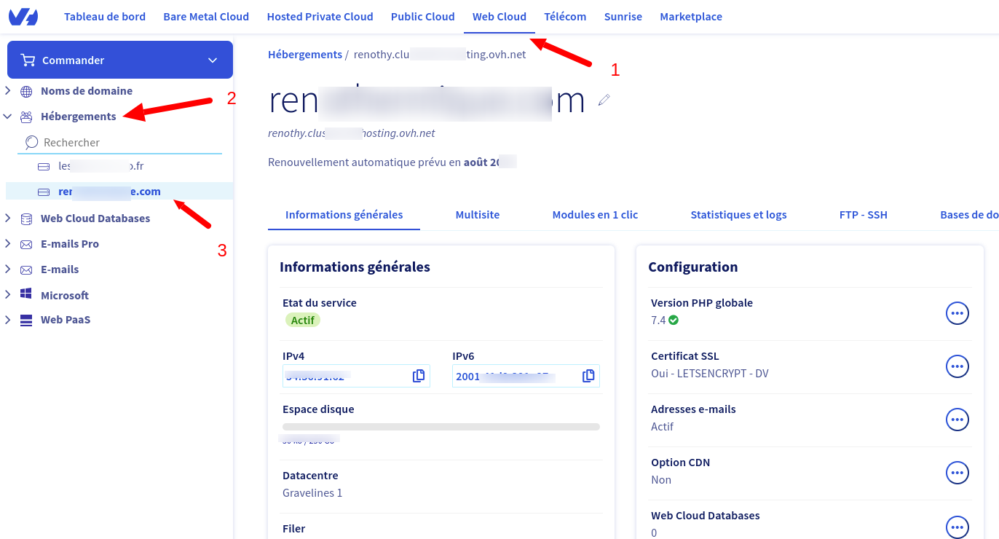
à ce stade, nous sommes deja sur notre espace d'hebergement, nous devons verifier et ajuster certains paramettres.

- **1/3 Verification de la version active de PHP** : Au niveau des pre-requis il est recommandé d'avoir au minimun php 8.3.
  Cliquez sur les 3 points dans le cercle et cliquez sur "modifier la configuration" :
  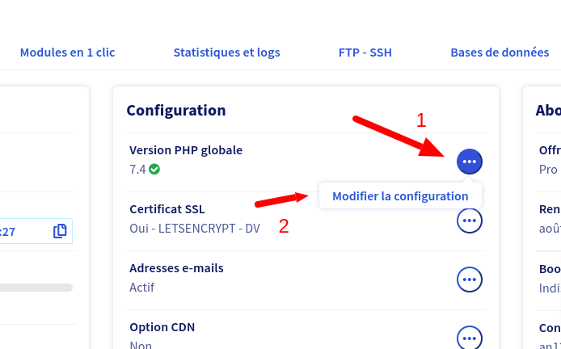
  ensuite :

* selectionner "Modifier la configuration courante" et cliquez sur "suivant".
* selectionner la version 8.3 et cliquez sur "valider".
  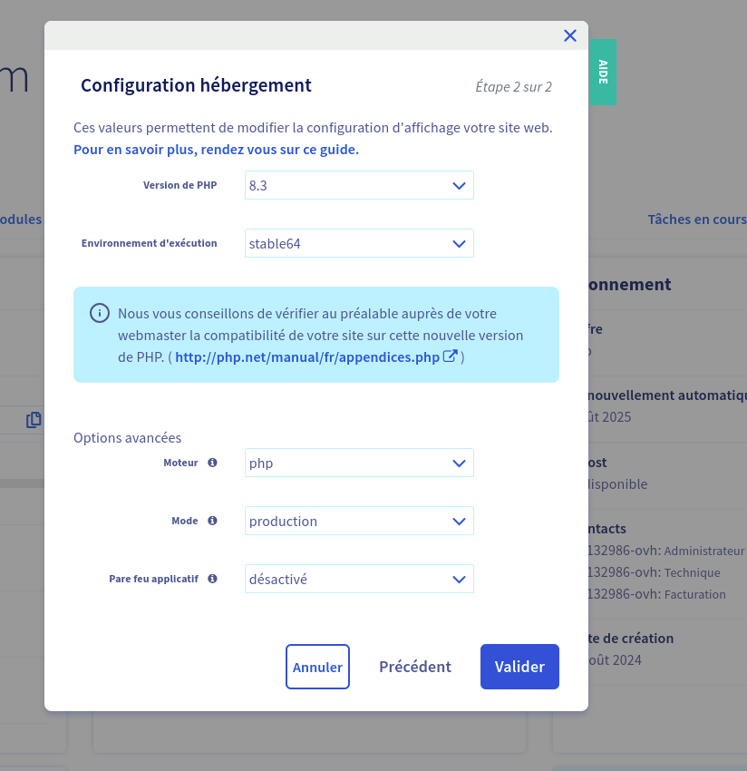

Vous devez patienter quelques minutes avant que cela ne prenne effet. <br>

- **2/3 Modification du dossier racine** : Cette etape permet de dire au serveur au se trouve le fichier index.php. :)
  Nous devons modifier le domaine et le premier sous domaine (www.); ainsi que la racine.
  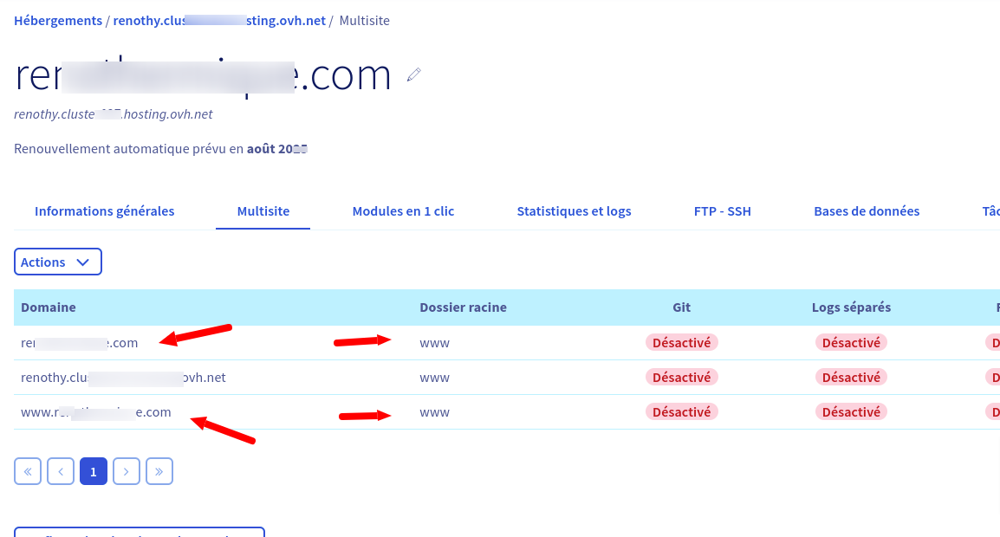
  Modification du domaine principal : Cliquez sur les 3 points dans le cercle, ensuite sur "modifier le domaine".
  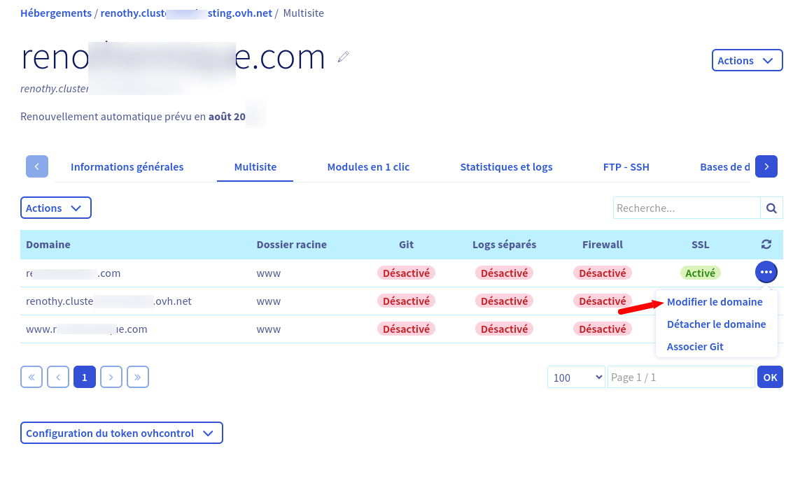
  Ensuite : Ajouter "/web" sur le champs "Dossier racine" :
  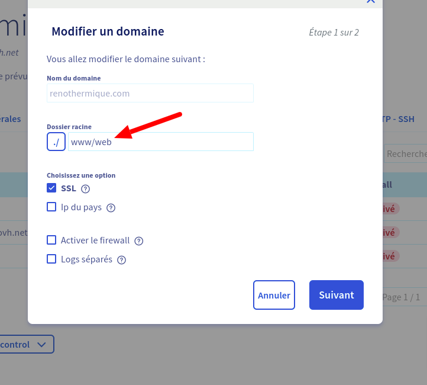
  Ensuite : Cliquez sur suivant et sur "valider".
  NB: Reprennez la meme proceduire pour le premier sous domaine, i.e celui commencant par "www." <br>
  à la fin vous devez optenir ceci :
  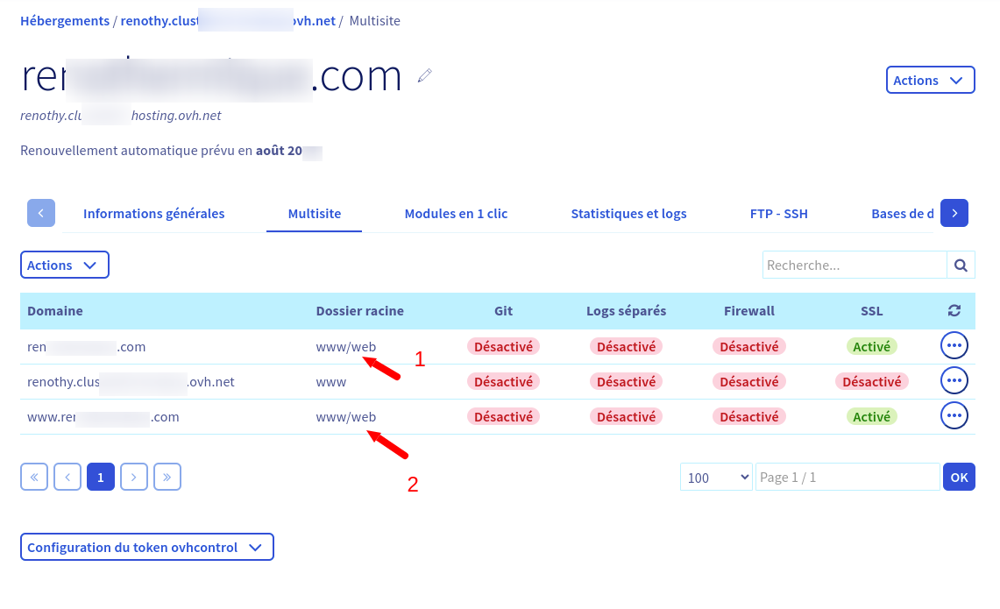

- **3/3 Mise en place de la base de donnée** : cliquez sur "action" ensuite "creer une base de données".
<div  class="alert alert-warning"> NB: vous devez retenir le mot de passe et le nom d'utilisateur, car vous aurriez besoin de ces informations pour la suite. </div>
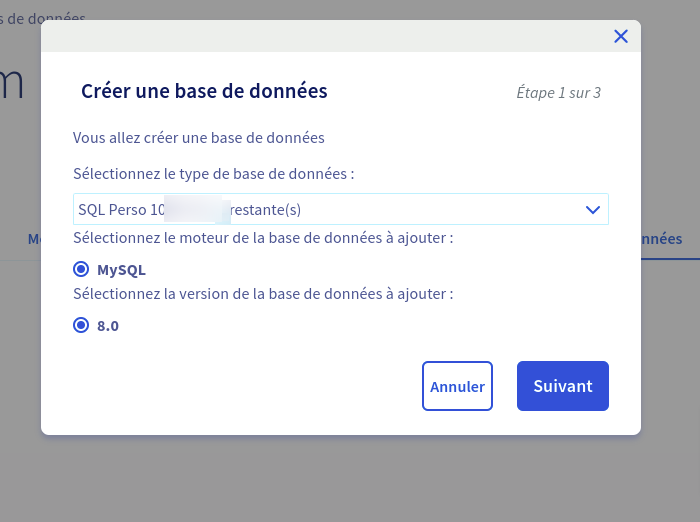
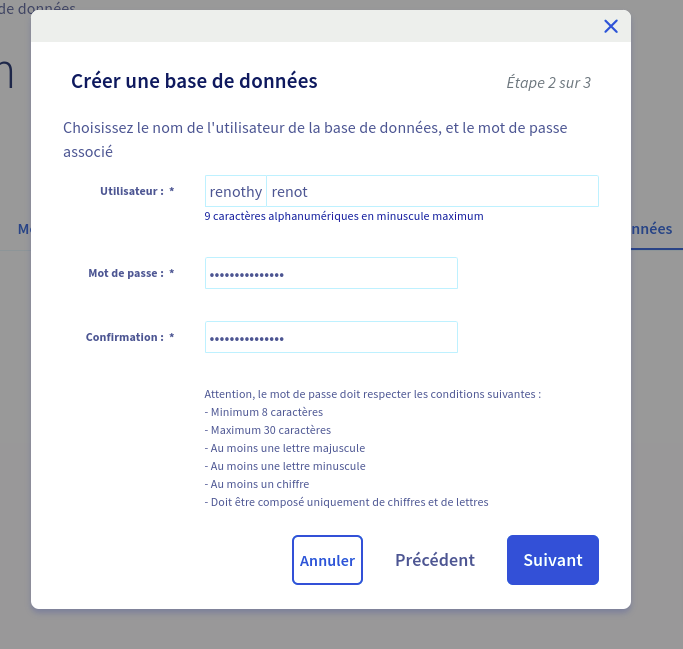
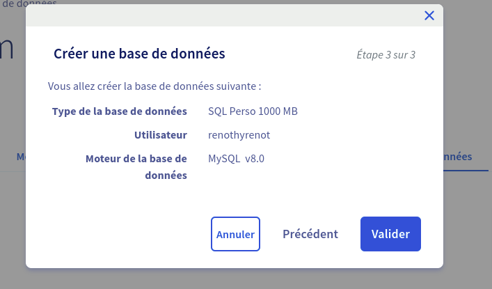
Une fois ces etapes terminer patientez quelques minute, vous devez obtenir ceci :
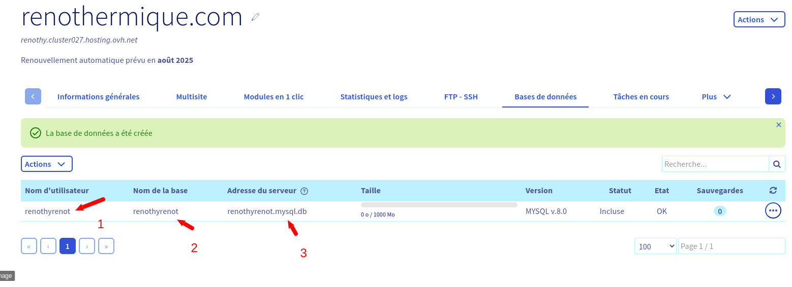
<div  class="alert alert-warning"> Les informations avec les fleches dessus sont tres importante pour la suite. </div>
Sur ceux, nous sommes arrives au bout de cette premier partie :). Notre espace d'hegement est enfin pret pour accueillir un site generer par wbhorison.

## Transfert des fichiers sur le serveur OVH

**1/3 : Obtenir les informations de connexion FTP**:
• Connectez-vous à votre espace client OVH.
• Allez dans la section "Hébergement" puis "FTP - SSH".
• Notez les informations de connexion FTP (hôte, utilisateur, mot de passe).

**2/3 : Utiliser un client FTP (comme FileZilla)**:
• Téléchargez et installez FileZilla.
• Ouvrez FileZilla et entrez les informations de connexion FTP.

**3/3 : Transfert des fichiers**:
Pour le transfert, nous allons vous proposez 2 approche :<br>
Methode 1 : pour debutant <br>
Le fichier telecharger lors des etapes precedante se termine par "...wb*horizon_com.zip". Dézipper ce fichier, à partir de fillezilla, **copier son contenu vers /www**.<br>
\_Cette methode est assez lente, et peut prendre jusqu'à 1 heure en fonction de votre vitesse de connexion.*<br>
Methode 2 : PRO <br>
Transferer le fichier zip directement sur /www. Connectez vous via un terminal (SSH) dezipper et transferer le contenu dans /www. N'oubliez pas de supprimer le dossier vide portant le nom "...wb_horizon_com".

```
ssh renothy@ssh.cluster027.hosting.ovh.net:22
```
