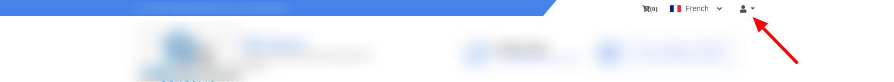
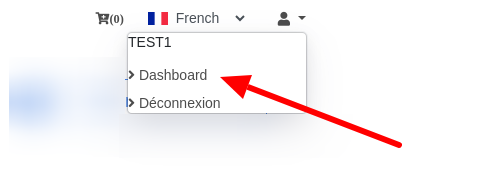
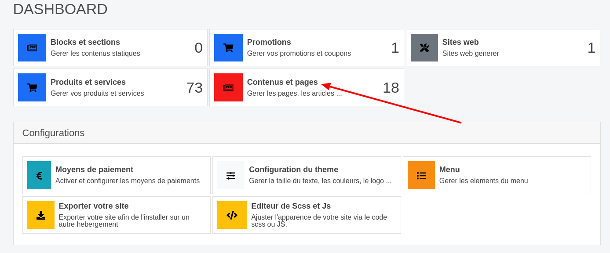
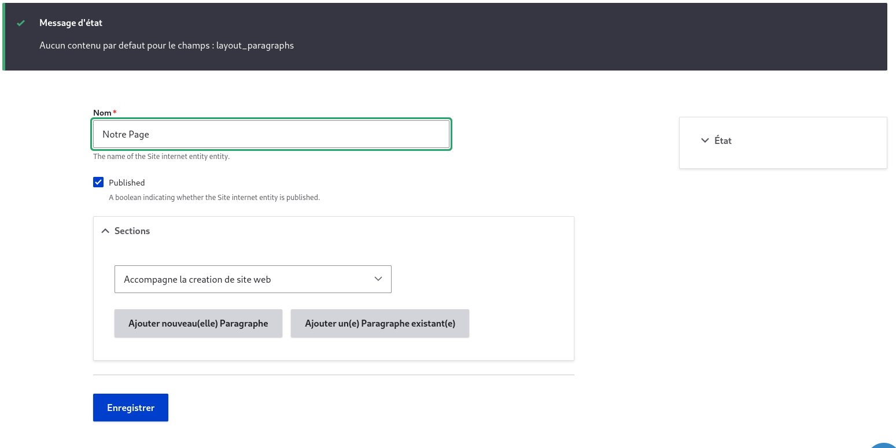
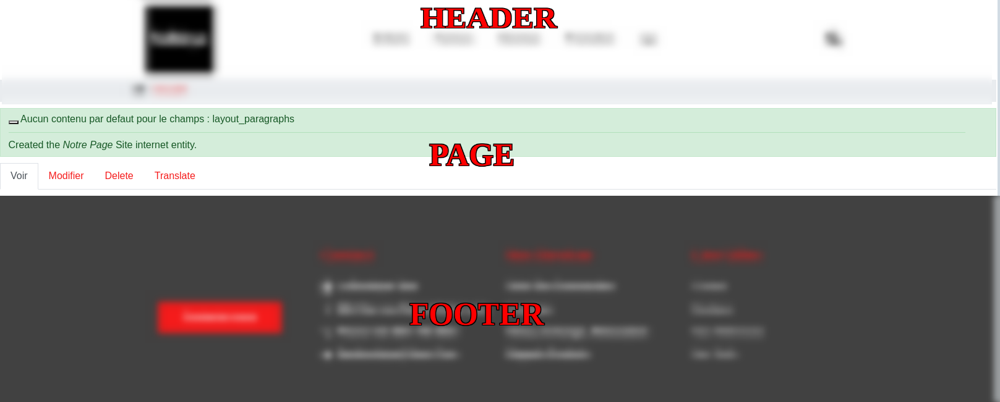
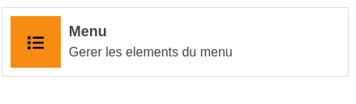
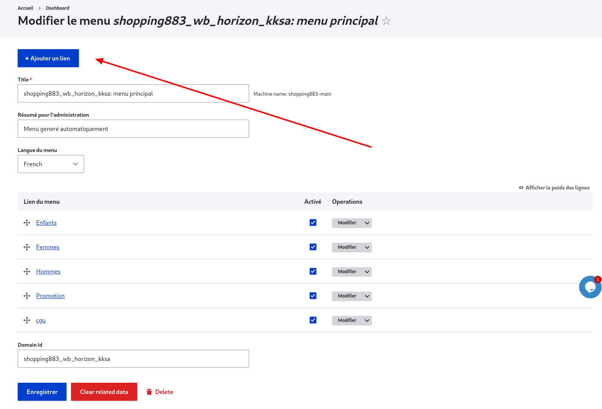
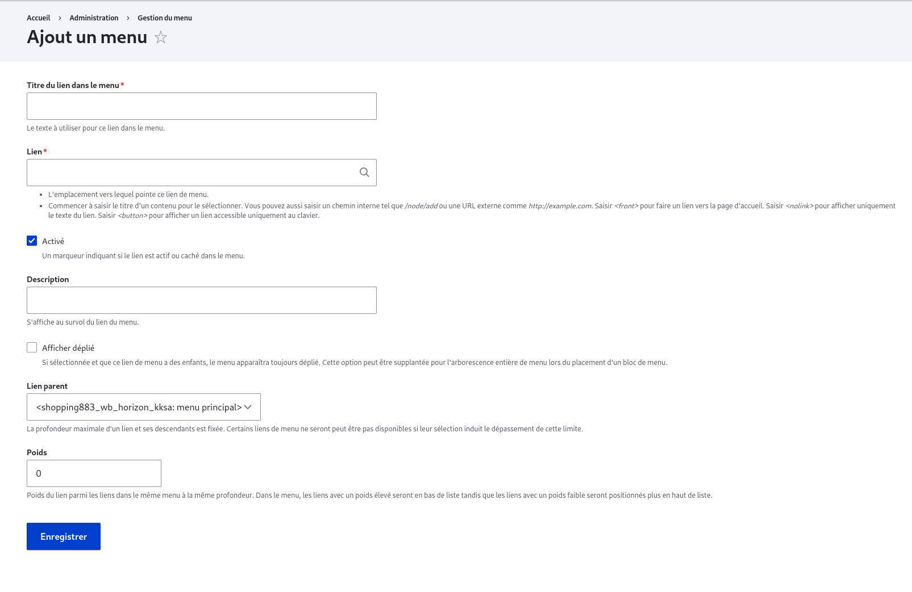
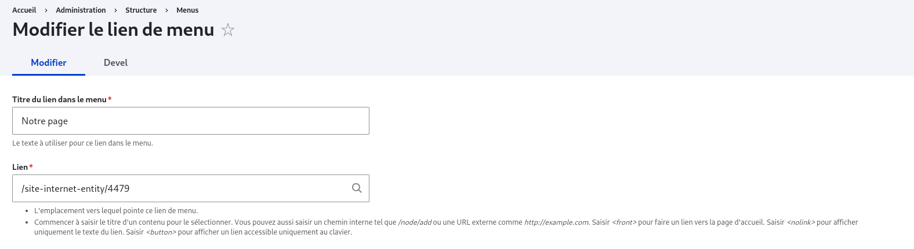
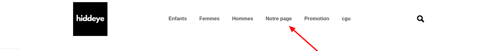

# Créer une page

## Introduction

Dans cette partie nous allons explorer le processus de création d'une page supplémentaire pour un site que nous avons généré.
En effet il n'est pas impossible que vous vouliez ajouter une page qui par defaut n'est pas rattachée à votre site pour y mettre un contenu en particulier sans avoir à par exemple avoir recourt au staff et devoir générer un tout nouveau site et pour se faire cette partie de la documentation est faite pour vous aider

Les différentes étapes que l'on va suite sont:

- Création d'une page
- Création d'un menu pour une page
- Ajout d'un contenu à une page

## À qui s'adresse ce tutoriel?

Le seul prérequis pour pouvoir suivre ce tuto est:

- Être propriétaire d'un site [wb-horizon](https://wb-horizon.com) ou simplement y etre administrateur

 
INFO

 dans la suite nous allons parler de la méthode universelle car les administrateur en cas de soucis peuvent utiliser d'autres méthode quel celle qui vous sera présentée

## Création d'une page

Pour créer une page supplémentaire pour votre site, tout d'abord vous devrez accéder à votre dashboard.
Pour se faire, cliquez sur l'icon **👤** dans votre barre de notification

De là vous pourrez cliquer sur \*\*Dashboard et vous accéderez ainsi au dashboard de votre site où vous pourrez faire un ensemble de configuration.

La page qui se présentera devra se présenter comme suite:

Ici ce qui nous interesse c'est **Contenus et pages** qui comme son nom l'indique déjà plus ou moins, nous permettra de gérer les contenus et les pages de notre site.
Une fois que aurez accédé à cette page, vous aurez des bloc comme celui ci dessous avec un titre, un bouton **+A jouter**, un tableau d'entités et un bouton **Plus de details**
Parmis tous ces blocs, le bloc qui nous intéresse ici est celui qui a pour titre l'un des elements suivant:

- architecte
- default commerce
- Partenaire
- rc-web

Ces labels représente en fait la catégorie de la page(il est prévu que cela soit changé dans les futures version de l'application pour un label plus intuitif)

 
INFO

 les entités qui sont listées dans ce le tableau de ce bloc sont les pages qui ont été créé après la création du site. les pages de base ayant été attaché au site n'y figure pas.

 
WARNING

 Il n'est pas impossible que lors de votre première accés à cette partie des configuration de votre site vous ne trouviez aucun site avec l'un des label mentionné un peu plus haut. Cela voudra dire qu'aucune page supplémentaire n'a jusque là été ajouté à votre site. Pour ajouter une page dans ce cas(tout du moins dans la version courante de l'application) il vous faudra vous rapprocher d'un administrateur qui lui pourra vous ajouter une page et par la même occasion vous permettre d'en ajouter d'autre sans soucis dans le futur

**Ex**:

avec

1. Label du bloc(ici la catégorie de notre site est architecte)
1. Bouton pour l'ajout d'une page

à ce stade il ne vous reste qu'à cliquer sur le bouton **+ Ajouter** pour obtenir un formulaire comme celui ci-dessous

Il est à noté que par défaut aucun champ n'a de valeur. Dans l'exemple ci dessus, nous avons nous même prérempli.

### Parlons des champs de ce notre formulaire de pages

Comme vous avez certainement pu le constater, le formulaire de création de notre page est composé de deux champs à savoir **Nom** et **Sections**.

- **Nom**: Naturellement, ce champ représente le nom de votre page. Bien que la plupart du temps il n'apparaît pas sur votre page, il est conseillé de choisir un aussi court et concis que possible car en dehors du fait que certaines sections affichent le nom de la page courante, l'alias de votre page( lorsqu'il est généré automatiquement) sera inspiré de ce nom. il est également à noter que ce champ est requis
- **Sections**: Ce champ contient les différentes sections qui composerons la page de votre siteweb. Il est prévu pour les prochaines version de wb-horizon d'ajouter à ce niveau là un de petit aperçu sur l'apparence de la section que vous êtes sur le point d'ajouter et le rendre ainsi un peu plus intuitif. pour l'instant si vous n'êtes pas administrateur sur wb-horizon il faudra y aller à l'intuition. Du plus amples détails sur cette partie seront données dans la partie [**Modifier un page**](/docs/gestion-sites-pages/create-a-page.html#ajout-d-un-contenu-a-une-page).

Pour l'instant on va se contenter de laisser notre page vide (sans sections). Eh oui on a le droit car contrairement au champ nom de notre page, le champ sections n'est pas à remplir obligatoirement.

Valider le formulaire en cliquant sur le bouton <button class="btn btn-primary">Enregistrer</button> obtiendrez ainsi la page ci-dessous

 
INFO

 La page ne commence en dessous des messages dans le fond vert et s'arrête au début de la partie floue avec le label footer.

## Création d'un menu pour une page

 
WARNING

Dans la version actuelle de wb-horizon, seuls les admins peuvent ajouter des menus

Vous l'avez peut être déjà remarqué mais dans notre menu jusque là il n'y a aucune référence à la page que nous venons juste de créer.
Nous de dire à notre site( plus précisément au menu de notre site) comment faire pour accéder à la page nouvellement créée mais tout d'abord faisons quelques remarques sur les urls et alias.

### Urls et Alias

Sur Drupal et particulièment dans l'application wb-horizon, les pages sont des types de contenus et de ce fait, chaque page que l'on cré possède une url qui lui est propre pour qu'on puisse accéder à son contenu de manière aisée. pour récupérer par exemple l'url de la page que nous avons créé dans la section précédente, il suffit de cliquer sur le bouton **modifier** dans la zone de notre page (voir la dernière capture de la partie [**Création d'une page**](/docs/gestion-sites-pages/create-a-page.html#creation-d-une-page) )

une fois sur cette page, l'url que nous avons obtenus de notre côté est la suivante **http://shopping883.wb-horizon.com/fr/admin/structure/site_internet_entity/4479/edit**

étant donné que nous sommes dans un sous domaine, notre url (la partie **https://** mise à part) est divisée en les parties suivantes:

- **shopping883**: Sous domaine du site (il est construit en fonction du nom de l'entreprise que vous avez renseigné)
- **wb-horizon.com/fr**: domaine + la langue selectionnée pour le site
- **admin/structure**: la route pour accéder à nos différents types d'entités(pour les admins uniquement)
- **site_internet_entity**: l'identifiant(ID) de l'entité chargé des site internet
- **4479**: L'identifiant(ID) unique de la page que nous venons de créer
- **edit**: l'action que nous menons sur notre entité

le sous domaine et le domain mis à part, tous les autres composants de notre adresse sont séparés par le caractère "**/**"
l'alias quand à lui est l'adresse qui vous présentée lorsque vous accéder à votre page. Pour y retourner il vous suffit de sauvegarder vos modification( bien qu'aucune modification n'ait été faite) ou alors juste retourner en arrière( en d'autre terme aller à la page precedente ).

Dans notre cas, l'url est sous la forme suivante **https://shopping883.wb-horizon.com/fr/notre-page**
Notre alias est tout ce qui est après **fr/**, en l'occurence **notre-page**

l'alias a pour rôle de remplacer l'url d'origin d'un site par quelque chose de compréhensible par l'homme. dans l'exemple que nous avons ici, pour accéder à notre page sans alias il faut transformer des composantes de l'url (ID de l'entité et ID de la page)
l'id de l'entité (**site_internet_entity**) devient **site-internet-entity** (on remplace les underscore par des tirets)
et on fait suivre ce que l'on a obtenu par **/{ID de la page}** en l'occurence **/4479**

En résumé vous pouvez accéder à votre page en faisant suite **https://shopping883.w-horizon.com/fr/** par l'alias (**notre-page**)
ou alors l'id que l'on fabriqué dans le paragraphe précédent **site-enternet-entity/4479**

### Ajouter notre menu

Maintenant que nous en savons plus sur les alias et les url des pages, plongeons directement dans la pratique. Plus haut, pour ajouter notre page nous sommes passer par le dashboard et pour les plus curieux d'entre vous, les autres actions qui y sont proposées ne sont pas passé inaperçu. vous avez donc sans doute remarqué notre bouton **Menu** C'est par lui que nous allons passer pour ajouter un lien dans notre menu. les étapes pour y arriver sont donc:

- Accéder au dashboard
- aller dans **Menu**  Vous obtiendrez un page similaire à celle ci dessous
  
  Pour ajouter un lien dans notre site, il suffit de cliquer sur le bouton <button class="btn btn-primary">+ Ajouter </button> ce qui nous permettra d'accéder au formulaire de création d'un lien. Ce formulaire se présente comme ci dessous (admin uniquement)
  
- Il ne vous reste qu'à remplir les champs du formulaire

Pour le remplissage du formulaire, les champs qui sont pertinent pour cette partie du cours sont:

- **Titre tu lien dans le menu** : Qui contiendra le texte qui sera visible dans le menu (dans notre cas nous mettrons **notre page**)
- **Lien**: qui contient le lien vers lequel le l'on veut que notre menu pointe

Le remplissage de la partie lien est particulière car elle peut contenir l'alias dont on a parlé plus haut tout comme elle peut contenir ce que l'on a appelé le lien fabriqué (**site-internet-entity/4479**) nous opterons toutes fois pour notre lien fabriqué pour une raison particulière que l'on a mentionné d'une manière assez discrète plus haut, L'alias est fonction du nom de la page. Ce qui veut dire que si à un moment donné l'on a envie de changer de nom pour notre page, l'alias se mettra à jour et notre menu renverra une erreur à chaque fois qu'il essaiera de se construire. Le line fabriqué quand à lui ne souffre pas de cette volatilité. Il restera le même peut importe les modifications que l'on fera sur le menu et ne disparaitra éventuellement que si la page à été supprimé.

notre formulaire sera donc rempli comme il suit:

Il ne reste plus qu'a sauvegarder notre formulaire et vérifier sa présence notre menu depuis une page choisi au hasard de notre site

nous avons donc ainsi

## Ajout d'un contenu à une page
