# Comment ajouter une page sur un site modèle à partir d’une page existante

## Étapes à suivre

### 1. Dupliquer la page existante

- Connectez-vous en tant qu’administrateur et accédez à la page que vous souhaitez dupliquer.

- Cliquez sur le bouton « Dupliquer la page ».
  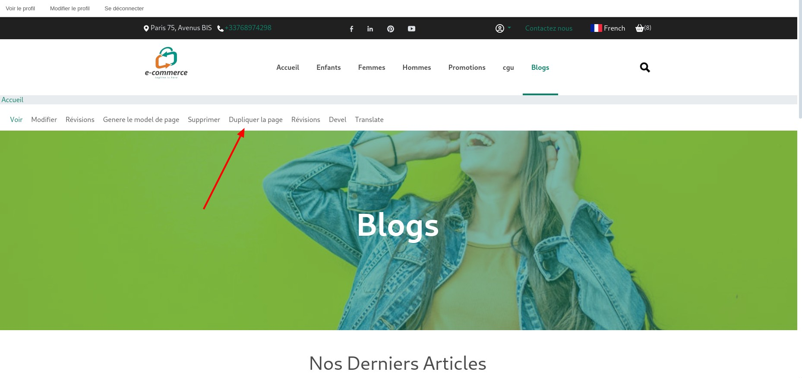

- Sélectionnez le domaine cible dans le champ « Sélectionner un domaine ».
  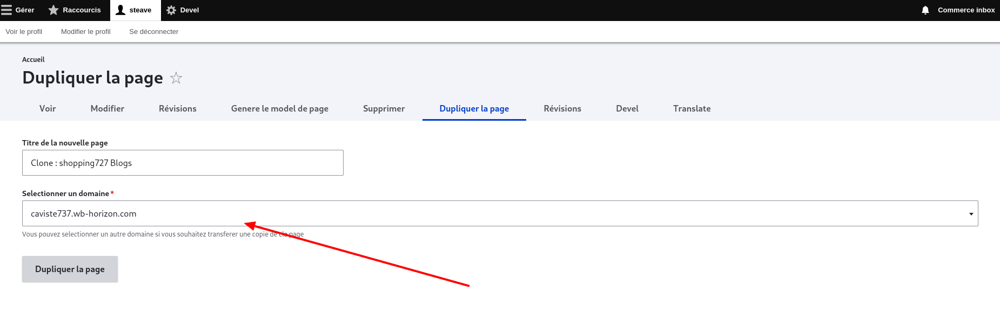

- Dans cet exemple, nous dupliquons la page blog de shopping727 vers caviste737.

- Remplissez le champ « Titre de la nouvelle page » et cliquez sur « Dupliquer la page ».

- **NB** : Le nom de la page résultante est celui marqué dans le champ « Titre de la nouvelle page ». Vous pouvez le changer avant la duplication ou le modifier sur la nouvelle page une fois créée.

Après la validation de notre formulaire nous obtenons le résultat ci-dessous
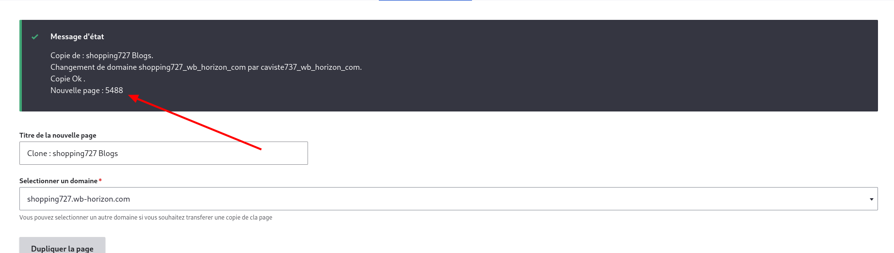

ce message nous indique que la duplication s’est passé sans erreurs et il nous fournit
également l’ID de la page qui a été créée (5488 notre cas). Il ne nous reste plus qu’à y
accéder depuis le domaine cible (caviste737 dans notre cas).

### 2. Accéder à la nouvelle page

- Connectez-vous au domaine cible (caviste737 dans notre cas) en tant qu’administrateur.

- Accédez au dashboard, puis à « Contenus et pages ».
  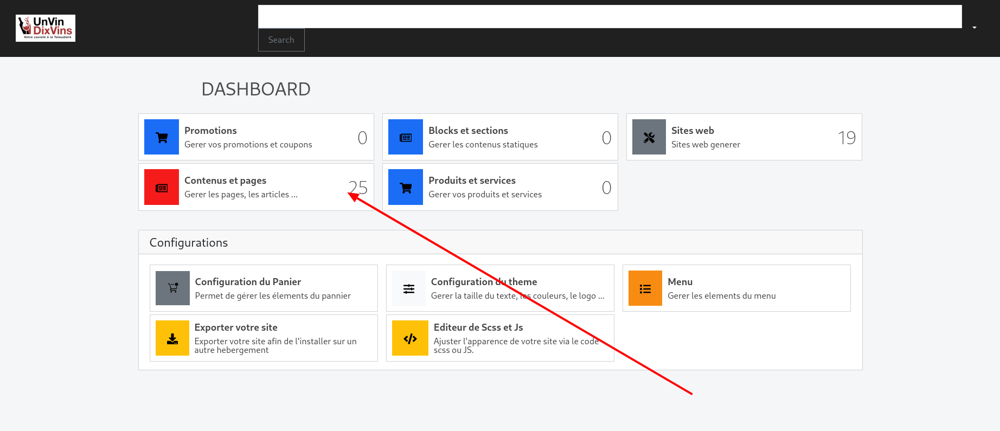

- Recherchez la nouvelle page dans les tableaux de pages. Elle se situe dans l’un des tableaux de pages : Page (architecte @deprecied), Page (default commerce @deprecied), Page (Partenaire @deprecied) et Page. Dans notre cas, la page se trouve dans Page (Default commerce @deprecied).
  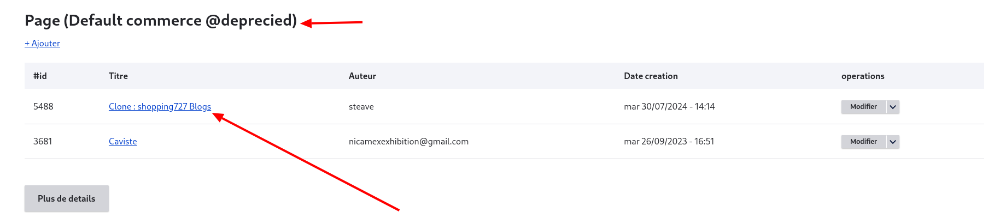

- Accédez à la page d’édition de la page en cliquant sur « Modifier ».

- Par défaut, il vous faudra retirer manuellement les valeurs du champ « Modèle de page ».
  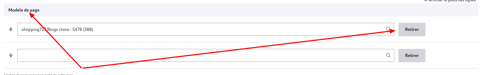

### 3. Ajouter la page au menu

- Accédez à votre dashboard et cliquez sur « Menu ».
  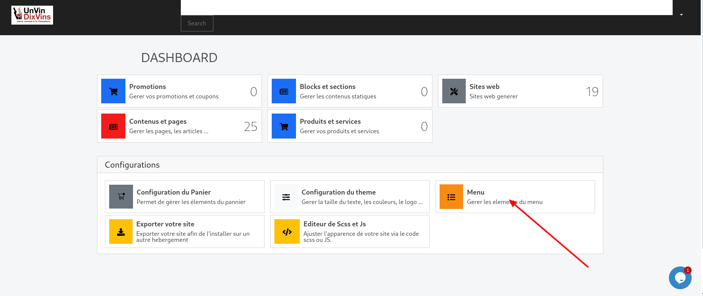

- Cliquez sur « Ajouter un lien ».
  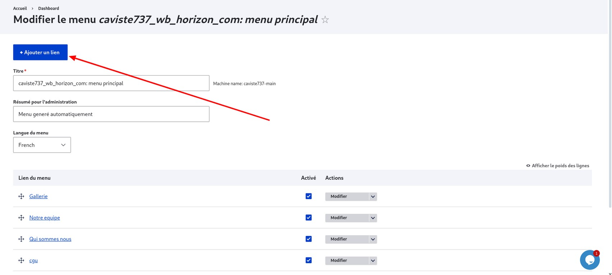

- Remplissez le formulaire :

  - **Titre du lien dans le menu** : Entrez le titre qui sera affiché sur le menu (dans notre cas, nous mettrons simplement Blogs).

  - **Lien** : Entrez le lien vers la page que vous venez d’ajouter à votre site. Celui-ci est de la forme « /site-internet-entity/{Id de la page} » où il faudra remplacer {Id de la page} par l’ID fourni à la fin de la duplication (5488 dans notre cas, donc /site-internet-entity/5488).

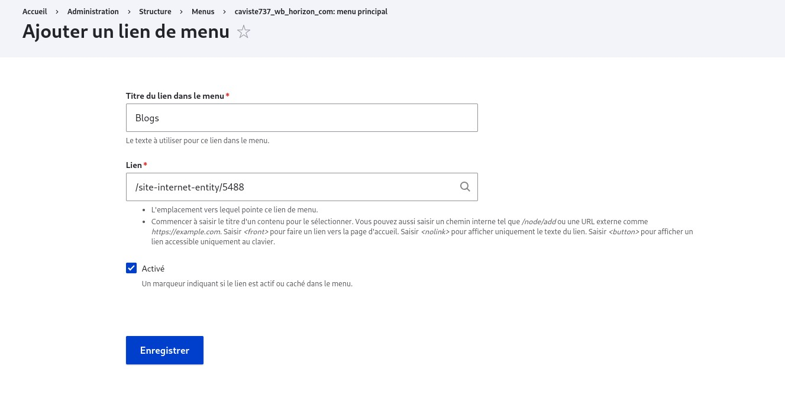

- Cliquez sur « Enregistrer » et vérifiez la présence de votre lien dans le menu sur la page d’accueil.
  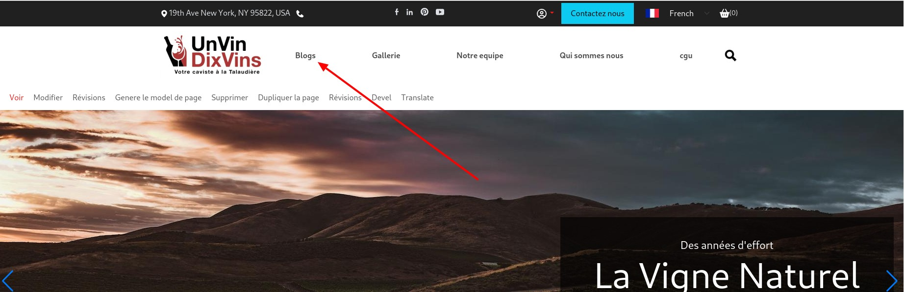

### 4. Définir la page comme modèle

- Accédez à la page que vous souhaitez transformer en modèle.

- Cliquez sur « Générer le modèle de page ». La page se recharge et un message indique l’ID du modèle de page généré (389 dans notre cas).
  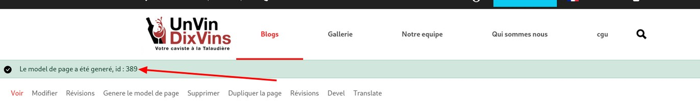

- Cliquez de nouveau sur « Générer le modèle de page » pour obtenir le label de votre modèle (Clone : shopping727 Blogs clone : 5488).

### 5. Récupérer l’ID du modèle de page d’accueil

- Accédez à la page d’accueil de votre site en tant qu’administrateur.

- Cliquez sur « Générer le modèle de page ». Un message indique l’ID du site modèle (114 dans notre cas).
  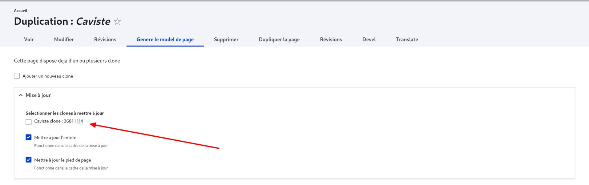

### 6. Synchroniser le modèle de page d’accueil

- Accédez au formulaire de votre modèle de page d’accueil en utilisant le lien suivant :

https://wb-horizon.com/fr/admin/structure/site_type_datas/{id du modèle de page}/edit

Remplacez {id du modèle de page} par l’ID de votre modèle de page d’accueil (114 dans notre cas, donc https://wb-horizon.com/fr/admin/structure/site_type_datas/114/edit).

- Naviguez jusqu’au champ « Page supplémentaire » et entrez le label du modèle de page généré (« Clone : shopping727 Blogs clone : 5488 »).
  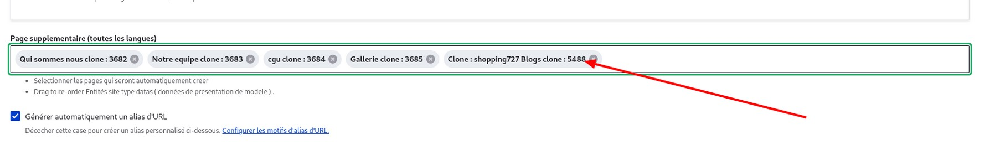

- Enregistrez vos modifications.

## Trouble Shooting

### Résoudre les problèmes de style

#### Recharger les styles :

- Accédez à Configuration > Interface utilisateur > layoutgenentitystyles config > generate style.
  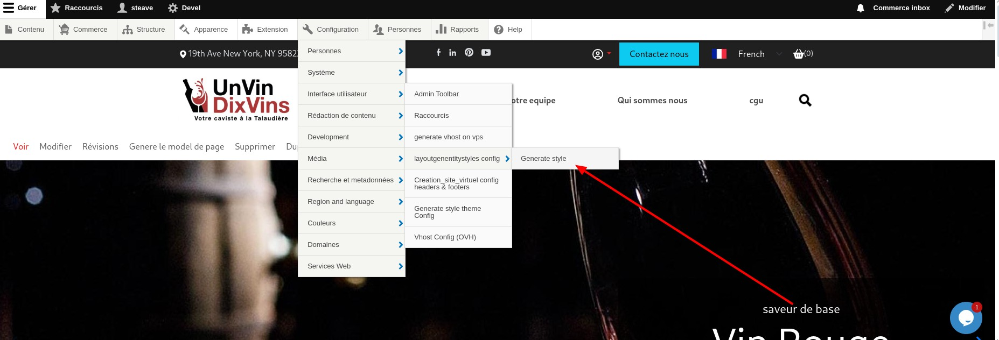
  Une fois la page chargée, les styles de votre site seront également chargés et vous verrez la liste des fichiers importés.

#### Régénérer les styles :

- Accédez à votre dashboard puis Configuration du thème.
  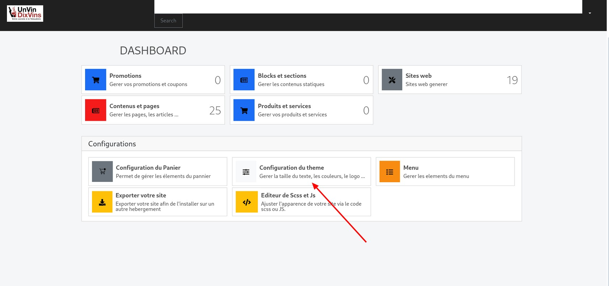

- Assurez-vous que le champ « Force à régénérer les fichiers npm » est désactivé.
  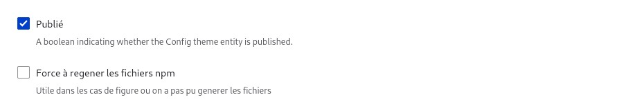

- Assurez-vous que le champ « Generate files styles » est activé.
  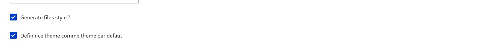

- Enregistrez votre configuration.

Accédez à votre page et actualisez en utilisant la combinaison de touches Ctrl+F5.
