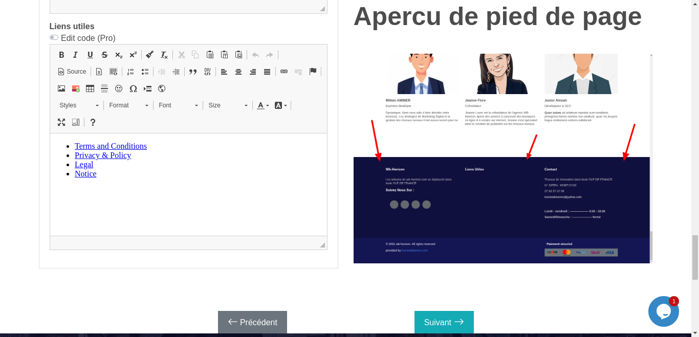

## Introduction

Comme mentionné dans la section précédente, wb-horizon vous permettra de créer un site en juste quelque clics. Pour commencer vous devrez vous rendre sur la plateform en cliquant sur le lien suivant [**wb-horizon**](http://wb-horizon.com).

Une fois sur la plateforme de wb-horizon,il faudra cliquer sur le bouton " **Nos models**" et par la suite, parmi les modèle qui vous sont présentés, chercher un model de site qui se rapproche le plus de ce que vous souhaitez obtenir à la fin de la génération (côté fontionnel et côté design). Une fois votre choix fais, cliquez sur le bouton "**je choisis**" comme cela est representer l'image en dessus

Il ne vous reste qu'a suivre les différentes étapes du formulaire à plusieurs étapes qui vous est présenté.

## Formulaire à plusieurs étapes

### Étape introductive

Dans cette étape il n'y a rien de particulier comme vous pouvez voir dans la capture ci dessous.
Cliquez sur **Suivant** pour réellement débuter le processus

### Étape 2: Nom de l'entreprise

Dans cette étape, vous entrerez le nom de votre structure. Ce nom sera également le constituant principale du sous domaine du site qui vous sera fourni

> [!NOTICE]
> Les sites généré avec wb-horizon ont tous des domaines de la forme **https://sous-domain.wb-horizon.com** où le sous domaine un composé par le nom machine de l'entreprise suivis d'un nombre(uniquement si necessaire) qui rend ce sous domaine unique tant que le propriétaire n'a pas acheter un nom de domaine et configuré sont site pour faire référence au domaine en question

 
<strong>Une fois cette etape finir il faudras cliquer sur le boutton suivant et vous verrez la page ci-dessus  sur laquelle vous allez choisir le theme de votre structure/model , une fois le theme choisir il faudras cliquer sur le boutton suivant comme cela est illustree sur l'image ci-dessus </strong>:

 

<strong>Sur la page suivante vous allez choisir le theme de couleur et cliquer sur le boutton suivant comme l'indique l'image</strong> :

 

 
<strong>Apres avoir choisir le theme de couleur , on clique sur le boutton suivant et on obtientlapage suivante comme l'indique l'image ci-dessus</strong>
 

 
<strong>Sur cette page comme l'indique l'image ci-dessus nous allons choisis la couleur , une fois cela est fais nous allons clique sur le boutton suivant et l'on obtiendras l'image suivante :</strong>

 

 
<strong>Sur l'image ci-dessus il faut choisir le logo de son model et puis cliquer sur le boutton suivant et l'on obtiendras l'image suivante : </strong>

 

 

Sur cette page juste cliquer sur le boutton suivant et la , on obtiendras la page suivante comme l'indique l'image ci-apres :

 

 

Ici juste cliquer sur le boutton suivant et l'on obtient la page suivante comme l'indique l'image suivante :

 

 

A ce stade nous sommes presque a la fin de creation de notre model de site ,ceci dit nous allons juste cliquer sur le boutton "Creer un site" , et l'on obtiendras la page suivante comme l'indique l'image suivante :

 

 

A ce niveau l'on devras attendre que le model de site finir de configurer toutes les sections du dit model et plus bas lorsque toutes les configurations seront finis , on auras l'image suivante :

 

 

A ce stade il faut copier le lien au bas de la page et l'ouvrir dans un autre onglet , une fois la page ouverte , l'utilisateur pourras y apporter des modifications selon sa convenance . Ceci dit supposons que le lien creer lors de la creation de ce model de site est le lien suivant: https://batiment723.wb-horizon.com/fr/ , ce lien en faite refere a un model de site faisant dans le batiment.
Une fois la page de ce model ouvert , a premiere vu l'on auras ceci comme l'indique l'image ci-apres :

 

