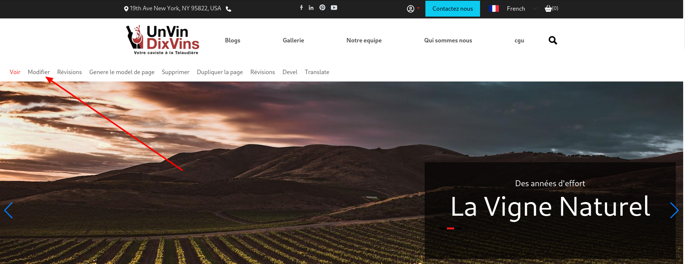
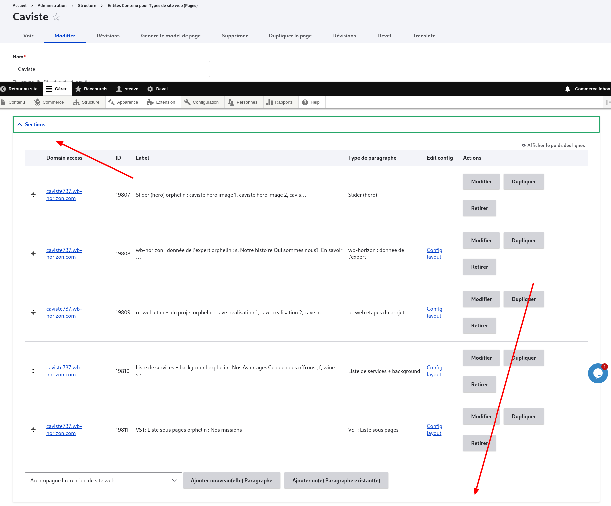
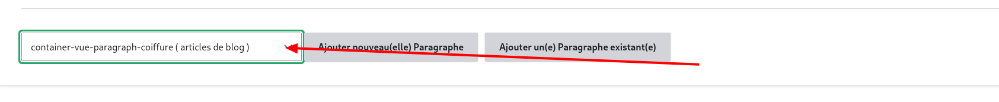
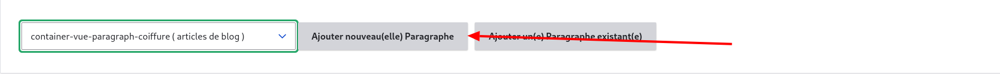
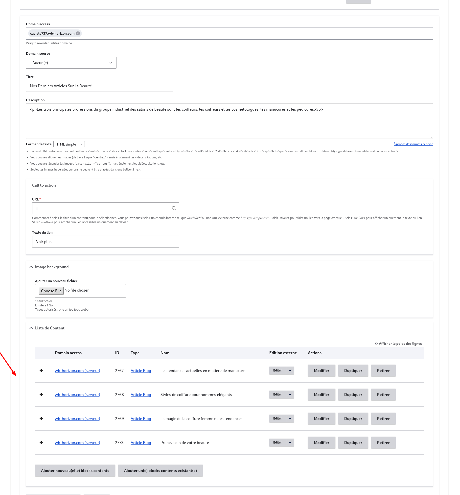
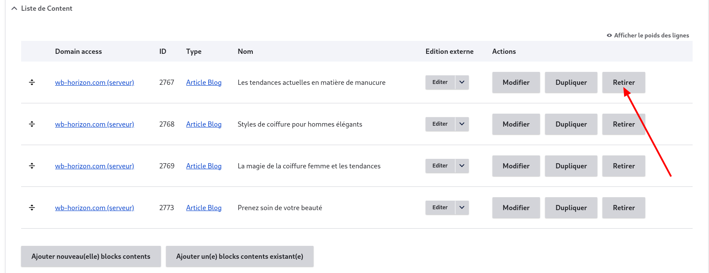
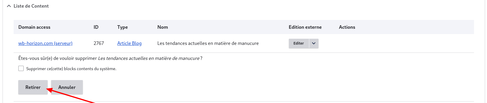
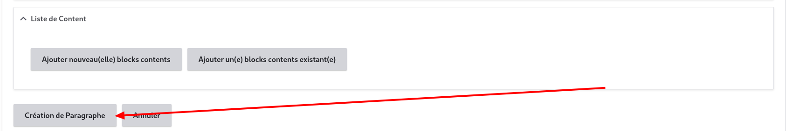
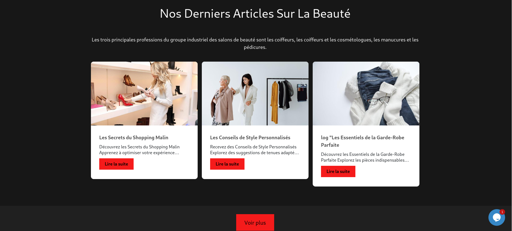

# Comment ajouter la vue des blogs à une page

## Étapes à suivre

1. **Accédez à la page**
   • Connectez-vous en tant qu'administrateur ou propriétaire du site sur lequel vous travaillez.

2. **Modifier la page**
   • Cliquez sur "Modifier".
   

3. **Naviguer vers la zone section**
   • Allez à la fin de la zone section.
   

4. **Sélectionner le conteneur de vue**
   • Dans le champ select, choisissez "container-vue-paragraph-coiffure (articles de blog)".
   

5. **Ajouter un nouveau paragraphe**
   • Cliquez sur "Ajouter (nouveau(elle) Paragraphe)".
   

6. **Mettre à jour le formulaire**
   • Le formulaire se met à jour et présente d'autres champs. Naviguez jusqu'à la zone "Liste de Content".
   

7. **Retirer les entrées**
   • Retirez chacune des entrées de cette zone (sans cocher "Supprimer ce(cette) blocks contents du système").
   
   

8. **Valider la création du paragraphe**
   • Cliquez sur "Création de paragraphe".
   

9. **Enregistrer la page**
   • Enregistrez la page.

10. **Résultats**
    

**NB** : En cas de problème de style, se référer à [**TroubleShooting**](/docs/gestion-sites-pages/duplicate-a-page.html#trouble-shooting)
