# Configuration de l'envoi des mails et manipulation des soumissions

Dans cette section, nous verrons comment configurer l'envoi des mails en fonction de l'un des formulaires de contact présents sur votre site et comment manipuler les soumissions.

Pour la suite de ce tutoriel, vous devez être connecté soit en tant que propriétaire de votre site, soit en tant qu'administrateur.

## Configurer le formulaire

Pour ce faire :

### Accéder au formulaire

- Accédez à votre dashboard.
  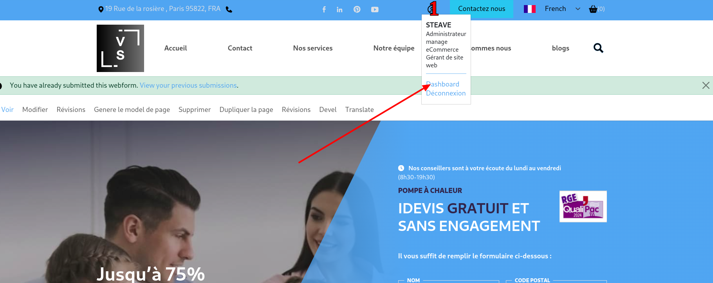

- Cliquez sur **configuration des formulaires**. Dans la page que vous obtenez, vous trouvez la liste des différents formulaires utilisés par votre site.
  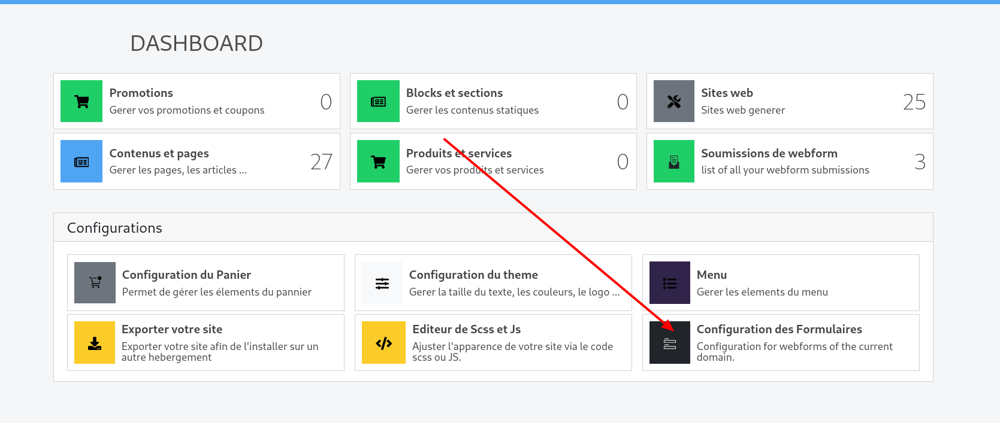

- Pour modifier l'un des formulaires qui vous est présenté, cliquez sur le bouton _modifier_ dans la colonne des actions de votre tableau sur la ligne du formulaire que vous souhaitez modifier.
  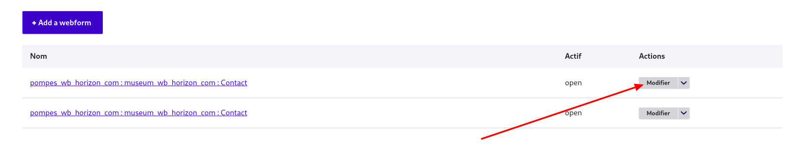

- Vous êtes maintenant dans la page d'édition de votre formulaire. Pour accéder à la configuration d'envoi des mails, cliquez sur **paramètres**.
  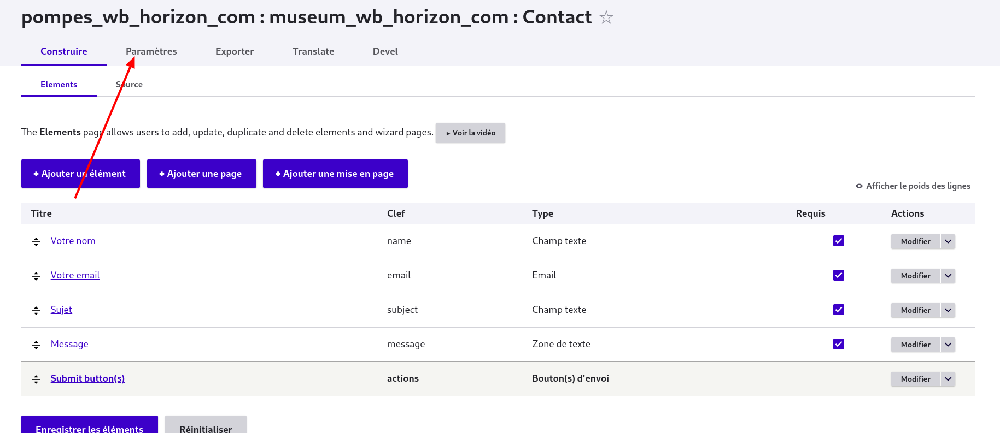

- Une fois sur la page des paramètres, cliquez sur "Courriels / Gestionnaires (Handlers)" dans le menu en dessous de celui des paramètres.
  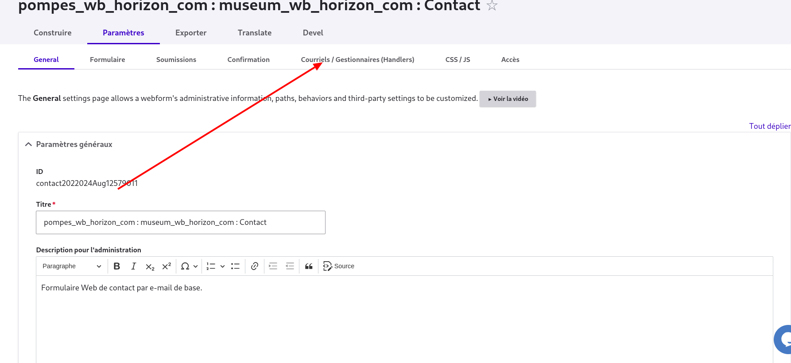

- Dans la page que vous obtenez, vous pouvez soit ajouter un nouveau courriel, soit modifier ceux déjà présents s'il y en a.

### Aouter un courriel

Ici, nous en ajouterons un pour vous permettre de vous familiariser avec l'environnement. Ainsi, vous pourrez comprendre ce qu'il y a lieu de faire si vous souhaitez mettre à jour des configurations déjà présentes.

- Pour ajouter un courriel, cliquez sur le bouton "+Ajouter un courriel".
  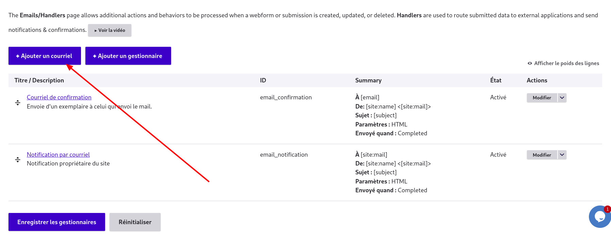

- Un formulaire apparaît à votre droite pour vous permettre de configurer le courriel en cours de création.

- Dans les paramètres généraux, renseignez un titre (pour l'administration) et éventuellement une note administrative pour décrire le courriel que vous créez.
  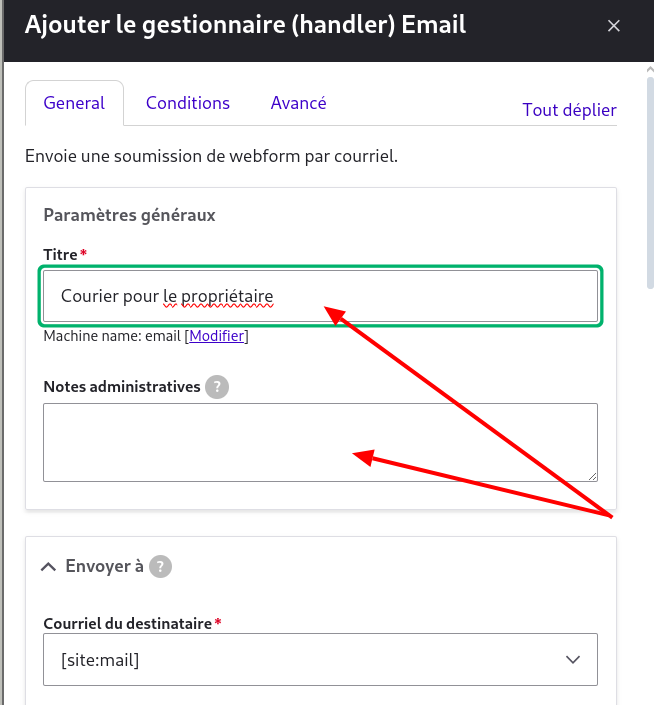

- Ensuite, dans la zone "envoyez à", accédez au champ courriel du destinataire. Dans notre exemple, nous voulons recevoir dans un email les valeurs soumises par l'utilisateur. Pour cela, nous mettons notre adresse mail dans laquelle on souhaite recevoir ces mails dans ce champ. De manière plus concrète, pour faire cela, vous devez tout d'abord sélectionner dans ce champ select "Adresse courriel du destinataire personnalisé...". Un champ apparaîtra en dessous de celui-ci et vous pouvez entrer dans le champ qui vient d'apparaître l'adresse mail qui doit recevoir la notification.
  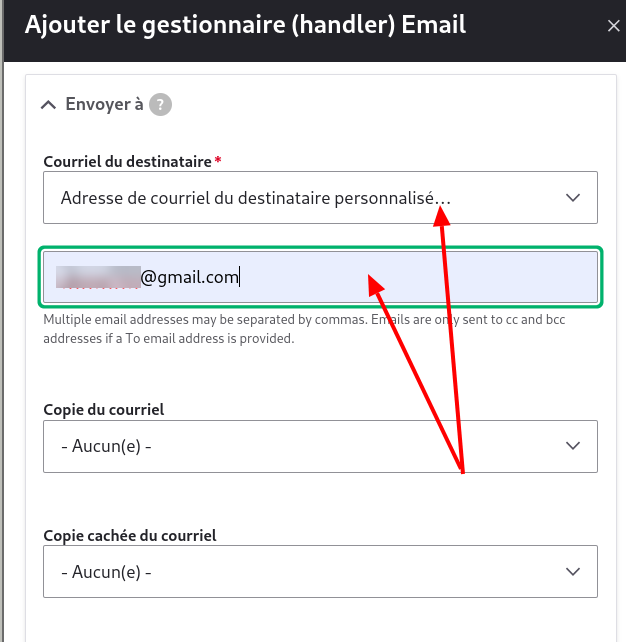

- Ensuite, naviguez vers le groupe de champs "Send from". Ici, il vous suffit de choisir (ou laisser si cette option est déjà sélectionnée) [site:name] et pour nom de l'expéditeur, laissez également la valeur à [site:name].
  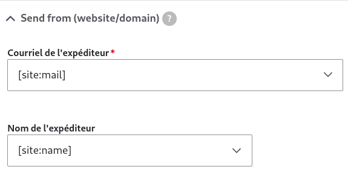

- Enfin, vous pouvez éventuellement configurer le message qui est envoyé en naviguant à la zone _Message_.
  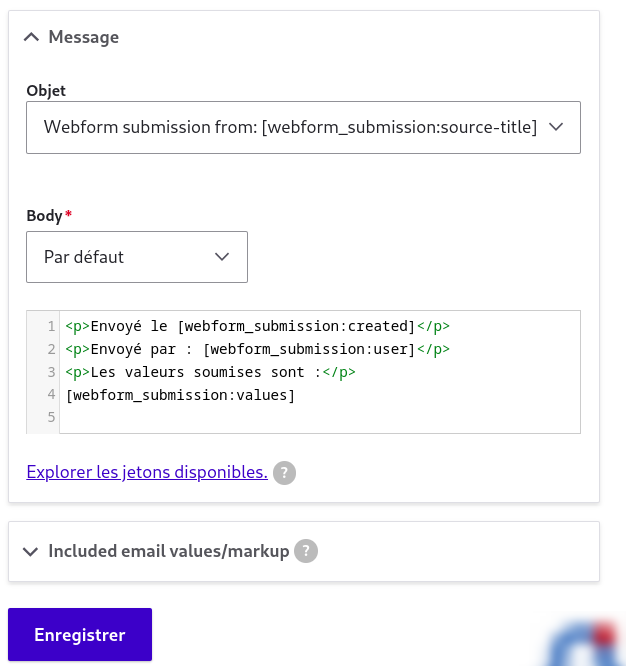

- Sélectionnez un objet parmi ceux proposés (si aucun ne vous convient, sélectionnez **objet personnalisé** et entrez dans le champ qui apparaît l'objet que vous assignez à votre email).

- Ensuite, accédez au champ body et sélectionnez dans le champ select juste en dessous de body le style de contenu que vous voulez envoyer et mettez-le en forme dans le champ input texte s'il est toujours présent.

Enregistrez vos modifications.

### Astuces

Assurez-vous que l'adresse mail du site est bien de la forme [site sous domaine]@wb-horizon.com.

Maintenant, votre formulaire est prêt à l'emploi.

## Accéder aux soumissions

Pour accéder aux différentes soumissions qui ont eu lieu sur votre site, accédez à votre dashboard.

- Cliquez sur **soumissions de webforms**.
  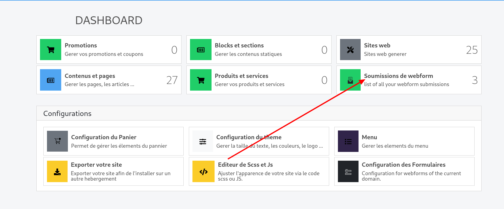

- Dans la page que vous obtenez, vous avez la liste des différentes soumissions sur tous les formulaires de votre site.

- Pour avoir les soumissions d'un ou de plusieurs domaines en particulier, entrez ces domaines dans le champ webforms du filtre au-dessus du tableau des soumissions et cliquez sur **filtrer**.
  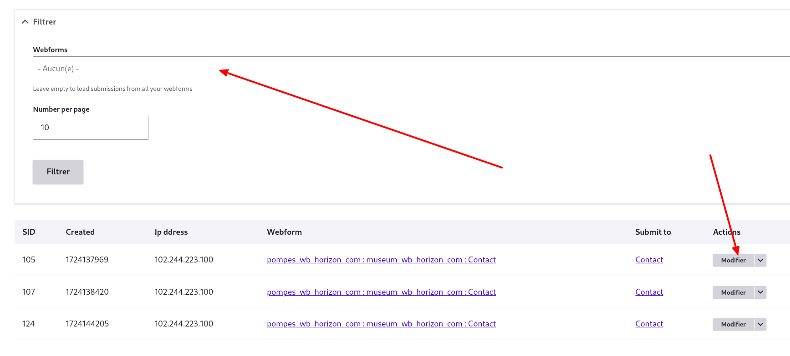

Vous pouvez maintenant effectuer des opérations telles que modifier, supprimer ou cloner une soumission.
