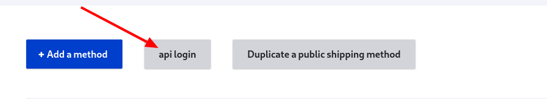
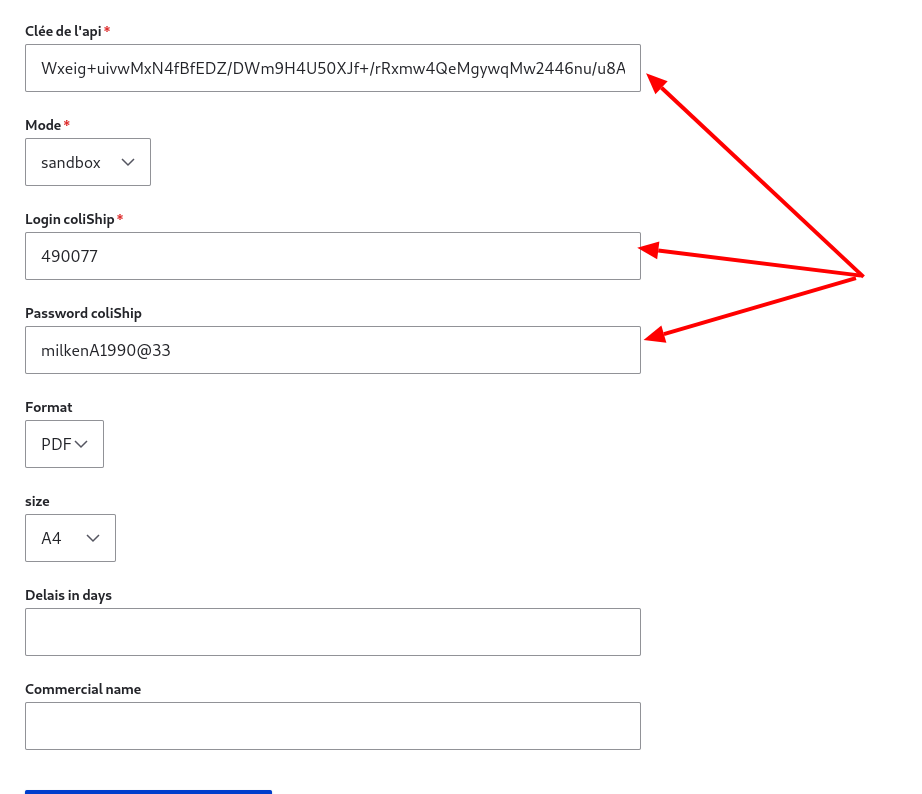
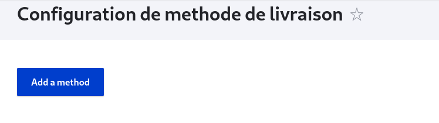
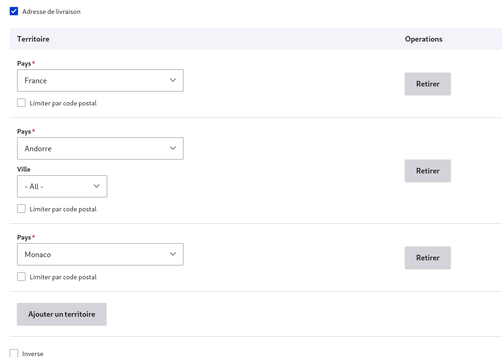

# Configurations

## Configurationns de base

## Configuration de l'API Colissimo pour la Sélection de Points Relais

Ce guide GitHub vous montre comment configurer l'API Colissimo dans votre boutique en ligne pour permettre à vos clients de choisir des points relais lors de la finalisation de leur commande.

### Étapes de Configuration

1. **Accédez à vos méthodes de livraison** : Connectez-vous à votre tableau de bord et sélectionnez l'option 'Shipping Methods' pour voir la liste des méthodes de livraison configurées.
   

2. **Ouvrez les Paramètres de l'API** : Cliquez sur 'api login' pour accéder aux paramètres de connexion à l'API Colissimo.
   

3. **Renseignez vos Informations ColiShip** :
   • Remplissez le champ 'clé de l'api' avec votre clé API Colissimo.
   

• Saisissez vos identifiants dans les champs 'login coliShip' et 'password coliShip'.

4. **Sauvegardez vos Configurations** : Après avoir renseigné les informations nécessaires, n'oubliez pas de sauvegarder pour conserver vos paramètres.

### Passage en Mode Production

• **Mode Sandbox vs Production**: Initialement, votre configuration sera en mode 'sandbox' pour les tests. Une fois que vous aurez vérifié que tout fonctionne correctement et que vous serez prêt à lancer votre boutique, vous devrez passer en mode 'production'.

• Pour ce faire, changez le réglage dans les paramètres de l'API de 'sandbox' à 'production' et sauvegardez à nouveau.

Assurez-vous de tester la configuration en mode 'sandbox' avant de passer en production pour éviter tout problème avec les commandes réelles des clients. 

## Configuration des methodes

### I.Guide d'Accès aux Configurations de Livraison

Avant de plonger dans les détails techniques de la configuration de votre méthode de livraison avec le module hbkcolissimochrono, voici comment accéder aux paramètres sur votre site :

1. [**Accédez au Dashboard de votre site**](https://www.bing.com/search?form=SKPBOT&q=Acc%C3%A9dez%20au%20Dashboard%20de%20votre%20site): Connectez-vous à l'interface d'administration de votre boutique en ligne.

2. [**Sélectionnez 'Shipping Methods'**](https://www.bing.com/search?form=SKPBOT&q=S%C3%A9lectionnez%20%26apos%3BShipping%20Methods%26apos%3B): Dans le menu principal, trouvez et cliquez sur l'option 'Shipping Methods'. Ici, vous verrez la liste des méthodes de livraison déjà configurées pour votre site.
   

3. _Ajoutez une Nouvelle Méthode_ : Pour intégrer une nouvelle méthode de livraison, cliquez sur le bouton 'Add a method'. Vous serez guidé à travers les étapes pour configurer une méthode de livraison qui répond aux besoins de vos clients et aux exigences de Colissimo.
   

Une fois que vous avez accédé à la section 'Shipping Methods', suivez les instructions détaillées ci-dessous pour configurer efficacement votre méthode de livraison.

### II. Effectuer les configurations

La mise en place d'une stratégie de livraison efficace est cruciale pour le succès de votre boutique en ligne. Avec le module hbkcolissimochrono, vous pouvez configurer des méthodes de livraison adaptées aux besoins spécifiques de vos clients, tout en respectant les tarifs de Colissimo. Dans cet article, nous allons nous concentrer sur un exemple de configuration pour Colissimo France métropolitaine. Pour les autres services tels que Colissimo Outre-mer, Colissimo international Europe et Colissimo international Monde, vous pourrez consulter les tableaux tarifaires dans l'index pour adapter votre configuration en fonction des spécificités de chaque type de livraison. Cela vous permettra de maîtriser le processus de configuration pour un cas spécifique, tout en ayant les ressources nécessaires pour l'appliquer à d'autres contextes de livraison.

#### • [**Choix du Plugin "Colissimo by HBK"**](https://www.bing.com/search?form=SKPBOT&q=Choix%20du%20Plugin%20%26quot%3BColissimo%20by%20HBK%26quot%3B):

Pour tirer parti des fonctionnalités du module hbkcolissimochrono, sélectionnez 'Colissimo by HBK' lors de la configuration de votre méthode de livraison. Après votre sélection, cliquez sur 'Suivant' pour continuer le processus de configuration.

#### • _Choix du Type de Colis par Défaut_

Sélectionnez le type de colis qui sera utilisé par défaut pour les envois, ce qui déterminera les options de conditionnement disponibles.

Pour le Choix du Type de Colis par Défaut, il est important de noter que la valeur par défaut que nous utilisons est un colis de dimensions 100cm x 25cm x 25cm. Cette taille a été choisie car elle respecte les exigences de Colissimo pour les colis standard, où la somme des trois dimensions (longueur + largeur + hauteur) doit être égale ou inférieure à 150cm, avec une longueur maximale (L) de 100cm. Assurez-vous de configurer cette dimension par défaut dans votre système pour garantir la conformité avec les standards de Colissimo et éviter tout surcoût lié au dépassement des dimensions autorisées.

#### • _Sélection du Type d'Envoi Colissimo_

Optez pour le service Colissimo qui correspond le mieux à vos besoins. Ici, nous sélectionnons "Colissimo with signature" car il s'agit de livraison à domicile, offrant plus de sécurité grâce à la confirmation de réception par signature.

#### • _Définition du Label de la Méthode de Livraison_

Le label défini sera visible par vos clients lorsqu'ils choisiront leur option de livraison, donc il doit être clair et descriptif.

#### • _Paramétrage du Poids Maximum_

Établissez le poids maximum que peut avoir un colis pour cette méthode de livraison, ce qui influencera les options de tarification.

#### • _Configuration du Prix par Poids_

Dans la section "Define price by weight", vous allez créer une série de paliers tarifaires basés sur le poids. Par exemple, le premier palier pourrait être de 0g à 250g. Ensuite, vous ajouteriez un second palier pour les colis de plus de 250g jusqu'à 500g. Chaque palier définit le coût d'expédition pour son intervalle de poids spécifique. Assurez-vous que ces paliers soient alignés avec le poids maximum autorisé pour éviter toute exclusion lors de l'enregistrement des paramètres.

Les configurations par défaut correspondent aux tarifs Colissimo standard pour la livraison à domicile vers la France métropolitaine, Monaco et Andorre. Pour des tarifs adaptés à d'autres zones, veuillez vous référer à l'index et ajuster cette section selon vos besoins.

#### • _Définition des Formats de Colis_

Cette étape est essentielle pour ajuster les frais de livraison selon la taille du colis. Colissimo distingue deux formats principaux de colis : standard et volumineux. Pour chaque format, vous devez définir un surcoût qui sera ajouté au tarif de base en fonction du poids. Vous pouvez également spécifier les dimensions pour chaque format. La dimension, exprimée en cm, correspond à la valeur maximale de la somme de la longueur (L), de la largeur (l) et de la hauteur (h) du colis (L+l+h). Par défaut, pour le format standard de Colissimo, cette valeur est de _150cm_ avec une longueur maximale (L) de _100cm_. Pour les colis volumineux, la valeur maximale est de _200cm_ avec une longueur (L) inférieure à _100cm_. Dans notre configuration, nous conserverons les valeurs par défaut de Colissimo, ainsi donc, _0€_ pour les produits standards et _6€_ pour les colis volumineux.

### • _Zonage de Livraison_

La définition précise des zones de livraison est un élément clé pour assurer que vos clients reçoivent leurs commandes de manière efficace. Voici comment procéder étape par étape :

1.  Accédez à la configuration de votre méthode de livraison et localisez l'onglet "Client" (1). C'est ici que vous allez définir les critères de livraison basés sur l'adresse du client.
2.  Recherchez l'option "Adresse de livraison" (2) et cochez-la. Cette action va déclencher l'affichage d'options supplémentaires pour définir les territoires de livraison.
3.  Un champ "Territoire" apparaîtra, vous permettant d'entrer le premier pays ou la première région pour laquelle vous souhaitez activer cette méthode de livraison. Vous pouvez également spécifier des plages de codes postaux pour affiner la zone de livraison (3).
4.  Si votre méthode de livraison doit couvrir plusieurs territoires, cliquez sur "Ajouter un territoire" (4) pour configurer chaque zone supplémentaire. Répétez ce processus pour chaque pays, région ou plage de codes postaux que vous souhaitez inclure.
    

    
    
    
    
    
    
    

    Pour notre exemple, nous configurons spécifiquement pour la France métropolitaine, Monaco et Andorre, en nous référant à la grille tarifaire de Colissimo. Les détails sont remplis comme suit.
    

    
    

    

    <strong>Note :</strong> La case 'Inverse', lorsqu'elle est cochée, exclut les emplacements spécifiés au lieu de les inclure. Cela permet de créer des exceptions pour certaines localisations sans avoir à lister toutes les autres qui sont éligibles.
    

