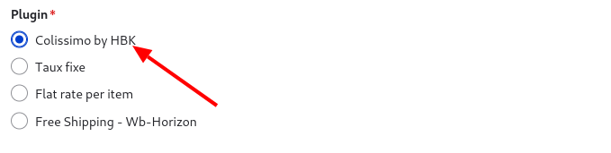
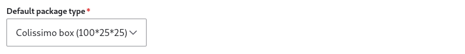
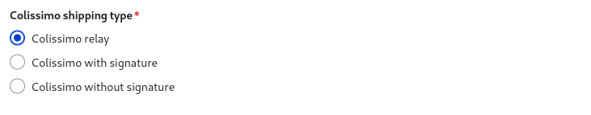
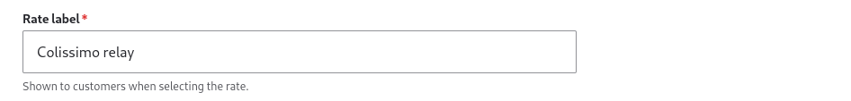
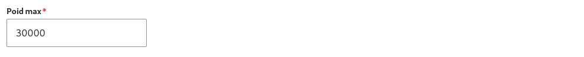
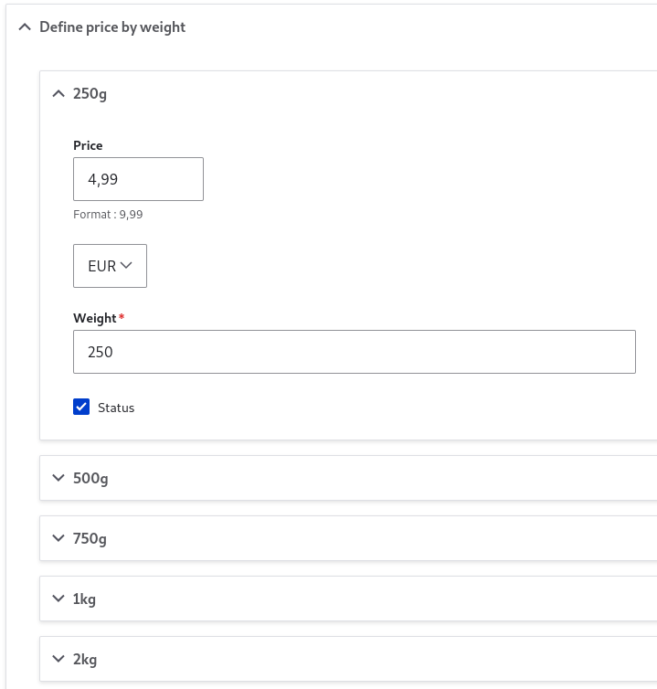
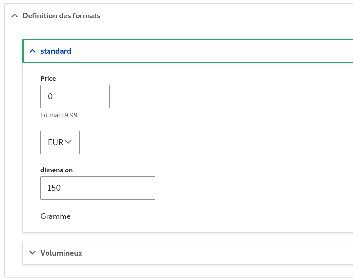
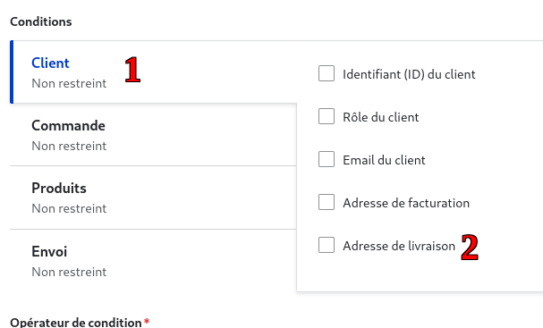
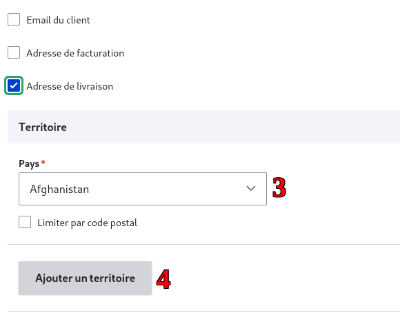

# Configuration de base

La mise en place d'une stratégie de livraison efficace est cruciale pour le succès de votre boutique en ligne. Avec le module hbkcolissimochrono, vous pouvez configurer des méthodes de livraison adaptées aux besoins spécifiques de vos clients, tout en respectant les tarifs de Colissimo. Dans cet article, nous allons nous concentrer sur un exemple de configuration pour Colissimo France métropolitaine. Pour les autres services tels que Colissimo Outre-mer, Colissimo international Europe et Colissimo international Monde, vous pourrez consulter les tableaux tarifaires dans l'index pour adapter votre configuration en fonction des spécificités de chaque type de livraison. Cela vous permettra de maîtriser le processus de configuration pour un cas spécifique, tout en ayant les ressources nécessaires pour l'appliquer à d'autres contextes de livraison.

## • **Choix du Plugin "Colissimo by HBK"**:

Sélectionnez "Colissimo by HBK" lors de l'ajout de votre méthode de livraison pour bénéficier d'une intégration optimisée avec les services Colissimo.

## • **Choix du Type de Colis par Défaut**

Sélectionnez le type de colis qui sera utilisé par défaut pour les envois, ce qui déterminera les options de conditionnement disponibles.

Pour le Choix du Type de Colis par Défaut, il est important de noter que la valeur par défaut que nous utilisons est un colis de dimensions 100cm x 25cm x 25cm. Cette taille a été choisie car elle respecte les exigences de Colissimo pour les colis standard, où la somme des trois dimensions (longueur + largeur + hauteur) doit être égale ou inférieure à 150cm, avec une longueur maximale (L) de 100cm. Assurez-vous de configurer cette dimension par défaut dans votre système pour garantir la conformité avec les standards de Colissimo et éviter tout surcoût lié au dépassement des dimensions autorisées.

## • **Sélection du Type d'Envoi Colissimo**

Optez pour le service Colissimo qui correspond le mieux à vos besoins, que ce soit un envoi en point relais, avec signature pour plus de sécurité, ou sans signature pour plus de souplesse.

## • **Définition du Label de la Méthode de Livraison**

Le label défini sera visible par vos clients lorsqu'ils choisiront leur option de livraison, donc il doit être clair et descriptif.

## • **Paramétrage du Poids Maximum**

Établissez le poids maximum que peut avoir un colis pour cette méthode de livraison, ce qui influencera les options de tarification.

## • **Configuration du Prix par Poids**

Dans la section "Define price by weight", vous allez créer une série de paliers tarifaires basés sur le poids. Par exemple, le premier palier pourrait être de 0g à 250g. Ensuite, vous ajouteriez un second palier pour les colis de plus de 250g jusqu'à 500g. Chaque palier définit le coût d'expédition pour son intervalle de poids spécifique. Assurez-vous que ces paliers soient alignés avec le poids maximum autorisé pour éviter toute exclusion lors de l'enregistrement des paramètres.

## • **Définition des Formats de Colis**

Cette étape est cruciale pour ajuster les frais de livraison en fonction de la taille du colis. Colissimo catégorise les colis en deux formats principaux : standard et volumineux. Pour chaque format, vous devez définir un surcoût qui sera appliqué en plus du tarif de base lié au poids. Les colis standards sont ceux dont la somme des dimensions (longueur + largeur + hauteur) ne dépasse pas un certain seuil, par exemple 100cm. Au-delà de ce seuil, le colis est considéré comme volumineux et un surcoût supplémentaire est appliqué pour tenir compte de l'espace qu'il occupe durant le transport. Vous devrez entrer ces informations dans les champs prévus à cet effet, en spécifiant le montant à ajouter pour chaque format et les dimensions correspondantes.

## • **Zonage de Livraison**

La définition précise des zones de livraison est un élément clé pour assurer que vos clients reçoivent leurs commandes de manière efficace. Voici comment procéder étape par étape :

1.  Accédez à la configuration de votre méthode de livraison et localisez l'onglet "Client" (1). C'est ici que vous allez définir les critères de livraison basés sur l'adresse du client.
2.  Recherchez l'option "Adresse de livraison" (2) et cochez-la. Cette action va déclencher l'affichage d'options supplémentaires pour définir les territoires de livraison.
3.  Un champ "Territoire" apparaîtra, vous permettant d'entrer le premier pays ou la première région pour laquelle vous souhaitez activer cette méthode de livraison. Vous pouvez également spécifier des plages de codes postaux pour affiner la zone de livraison (3).
4.  Si votre méthode de livraison doit couvrir plusieurs territoires, cliquez sur "Ajouter un territoire" (4) pour configurer chaque zone supplémentaire. Répétez ce processus pour chaque pays, région ou plage de codes postaux que vous souhaitez inclure.
    

    
    
    
    
    
    
    

