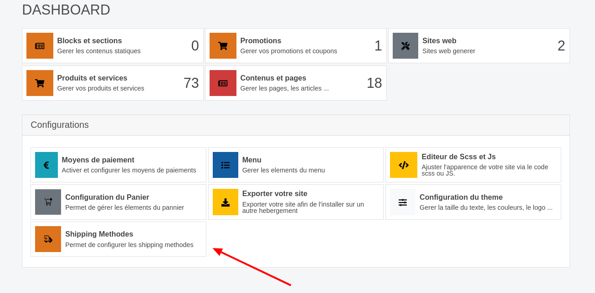
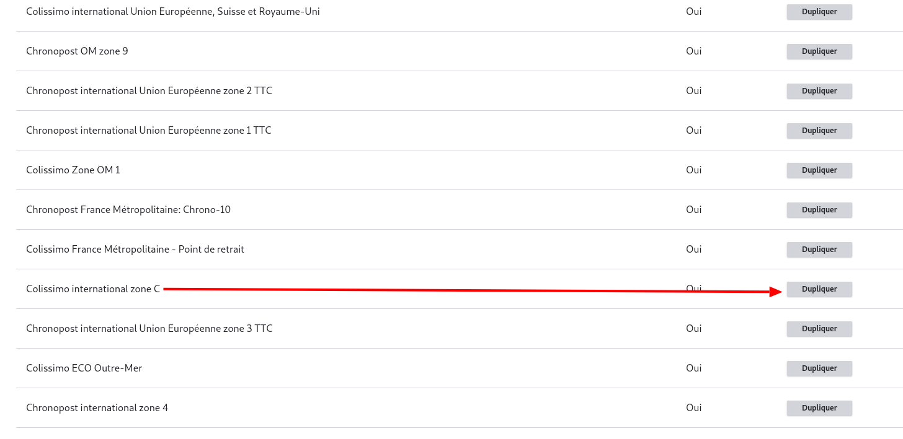

# Guide de Duplication des Configurations de Livraison

Ce guide vous explique comment dupliquer une configuration de livraison par défaut pour Colissimo ou Chronopost sur votre site e-commerce.

## Étapes pour Dupliquer une Méthode de Livraison

1. [**Accédez à vos méthodes de livraison**](https://www.bing.com/search?form=SKPBOT&q=Acc%C3%A9dez%20%C3%A0%20vos%20m%C3%A9thodes%20de%20livraison) : Connectez-vous à votre tableau de bord et sélectionnez l'option 'Shipping Methods' pour voir la liste des méthodes de livraison configurées.
   

2. [**Dupliquez une méthode publique**](https://www.bing.com/search?form=SKPBOT&q=Dupliquez%20une%20m%C3%A9thode%20publique) : Cliquez sur 'duplicate public method' pour afficher une liste des méthodes disponibles à la duplication.
   

3. [**Sélectionnez la méthode à dupliquer**](https://www.bing.com/search?form=SKPBOT&q=S%C3%A9lectionnez%20la%20m%C3%A9thode%20%C3%A0%20dupliquer) : Trouvez la méthode que vous souhaitez dupliquer et cliquez sur 'dupliquer' à côté de celle-ci. Vous serez redirigé vers un formulaire similaire à celui utilisé pour l'édition d'une méthode de livraison.
   

4. [**Nommez votre méthode**](https://www.bing.com/search?form=SKPBOT&q=Nommez%20votre%20m%C3%A9thode) : Remplissez le champ 'nom' de la méthode de livraison, car il est vide par défaut.
   

5. [**Vérifiez les configurations préremplies**](https://www.bing.com/search?form=SKPBOT&q=V%C3%A9rifiez%20les%20configurations%20pr%C3%A9remplies) : Les tarifs en fonction des poids et les pays concernés sont déjà préremplis. Vous pouvez les laisser tels quels ou les modifier pour qu'ils correspondent à vos préférences.

6. [**Enregistrez vos configurations**](https://www.bing.com/search?form=SKPBOT&q=Enregistrez%20vos%20configurations) : Une fois que vous avez vérifié et/ou modifié les détails, enregistrez vos configurations pour appliquer la nouvelle méthode de livraison.

[**Note :**](https://www.bing.com/search?form=SKPBOT&q=Note%20%3A) Il est important de personnaliser les tarifs et les zones de livraison pour qu'ils reflètent les besoins spécifiques de votre entreprise et de vos clients.

## Conclusion

La duplication d'une méthode de livraison est un processus simple qui vous permet de personnaliser et d'étendre vos options de livraison rapidement. Assurez-vous de revoir toutes les configurations pour garantir qu'elles répondent aux exigences de votre service de livraison.
