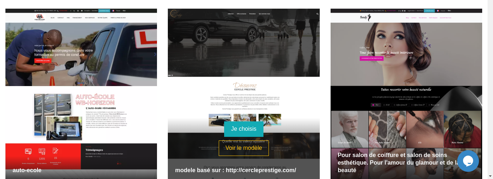
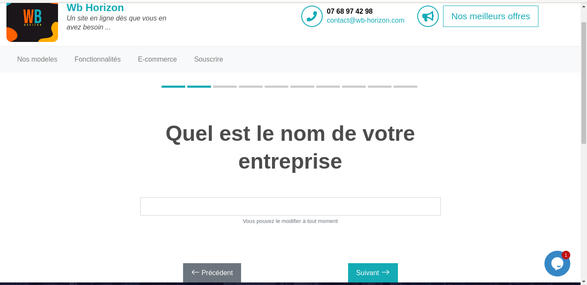
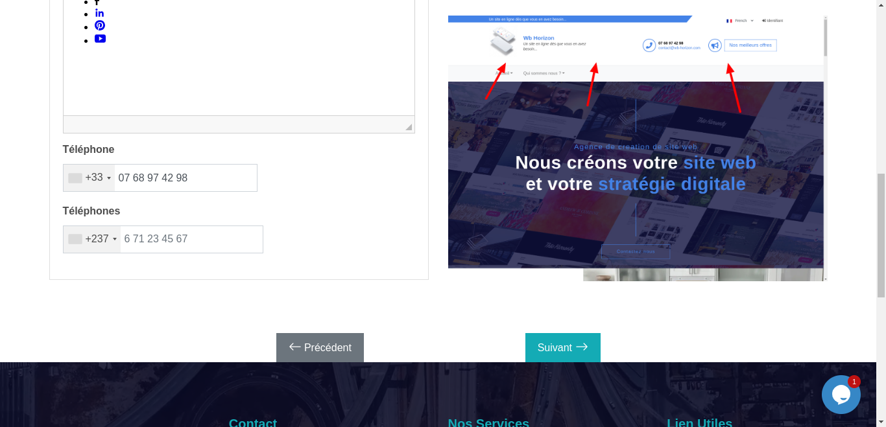

# CREATION D'UN MODELE DE PAGE
## Apercu !!

Pour créer un modèle de page sur la plateforme wb-horizon, une fois connecté, l'utilisateur devra choisir son modèle. Une fois le modèle choisi, l'utilisateur devra cliquer sur le bouton "Je choisis". Ensuite, après avoir cliqué sur ledit bouton, il devra suivre les différentes étapes. Une fois cette phase terminée, le client/utilisateur devra apporter des modifications selon sa convenance. Une fois ces modifications terminées, il devra simplement générer ledit modèle.

<strong>Suivre les etapes suivantes a partir de ces images illustratifs</strong>

<h2> ETAPE 1 : Ce rendre sur la plateforme wb-horizon</h2>
Pour s'y rendre saisirle lien suivant dans votre moteur de recherche : https://wb-horizon.com/ , une fois sur la plateforme de wb-horizon il faudras cliquer sur le bouton :Nos models et par la suite choisir un model  sur lequel vous allez travailler et une fois le model choisir , il faudras cliquer sur le bouton "je choisis" comme cela est representer l'image en dessus

 
<h2> ETAPE 2:Suivre les differentes etapes</h2>

Cliquer sur le bouton : SUIVANT , comme l'indique l'image ci-dessus

 

<strong>Par la suite une nouvelle va apparaitre comme l'indique l'image ci-dessus et vous allez choisir le nom de votre structure ou siteweb.</strong>

 
<strong>Une fois cette etape finir il faudras cliquer sur le boutton suivant et vous verrez la page ci-dessus  sur laquelle vous allez choisir le theme de votre structure/model , une fois le theme choisir il faudras cliquer sur le boutton suivant comme cela est illustree sur l'image ci-dessus </strong>:

 

<strong>Sur la page suivante vous allez choisir le theme de couleur et cliquer sur le boutton suivant comme l'indique l'image</strong> :

 

 
<strong>Apres avoir choisir le theme de couleur , on clique sur le boutton suivant et on obtientlapage suivante comme l'indique l'image ci-dessus</strong>
 

 
<strong>Sur cette page comme l'indique l'image ci-dessus nous allons choisis la couleur , une fois cela est fais nous allons clique sur le boutton suivant et l'on obtiendras l'image suivante :</strong>

 

 
<strong>Sur l'image ci-dessus il faut choisir le logo de son model et puis cliquer sur le boutton suivant et l'on obtiendras l'image suivante : </strong>

 

 

Sur cette page juste cliquer sur le boutton suivant et la , on obtiendras la page suivante comme l'indique l'image ci-apres :

 

 

Ici juste cliquer sur le boutton suivant et l'on obtient la page suivante comme l'indique l'image suivante : 

 

 

A ce stade nous sommes presque a la fin de creation de notre model de site ,ceci dit nous allons juste cliquer sur le boutton "Creer un site" , et l'on obtiendras la page suivante comme l'indique l'image suivante : 

 

 

A ce niveau l'on devras attendre que le model de site finir de configurer toutes les sections du dit model et plus bas lorsque toutes les configurations seront finis , on auras l'image suivante : 

 

 

A ce stade il faut copier le lien au bas de la page et l'ouvrir dans un autre onglet , une fois la page ouverte , l'utilisateur pourras y apporter des modifications selon sa convenance . Ceci dit supposons que  le lien creer lors de la creation de ce model de site est le lien suivant: https://batiment723.wb-horizon.com/fr/ , ce lien en faite refere a un model de site faisant dans le batiment. 
Une fois la page de ce model ouvert , a premiere vu l'on auras ceci comme l'indique l'image ci-apres : 

 

 

A ce stade pour apporter des modifications selon la convenance du client , la premiere des choses seras de ce connecter avec ses identifiants , une fois cette phase terminer l'utilisateur pourras a present apporter des modifications .

<h2>ETAPE 3 : MODIFICATION DE LA PAGE</h2>

<h5>SE CONNECTER</h5>
Une fois connecter l'on peut deja commencer avec les modifications , en cliquant le boutton "identifiant en haut de la page " l'on obtient la page suivante comme l'indique l'image suivant : 

 

Une fois  que l'utilisateur se connecte il pourras ainsi commencer a faire des modifications au niveau de ladite page , ceci dit apres la phase de connection il obtiendras la page suivante :

 

Comme vous pouvez le remarquer sur l'image precedente deux cases ont ete encercler , sur cette image vous allez remarquer que deux sections ont ete encercler il s'agi bien des liens de modifications a savoir le lien modifier lui et l'icone crayon

