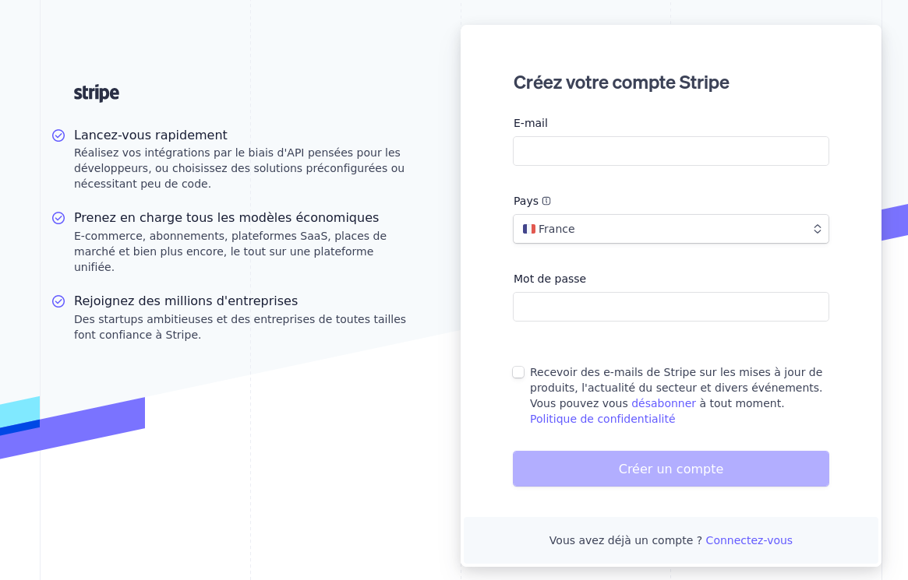
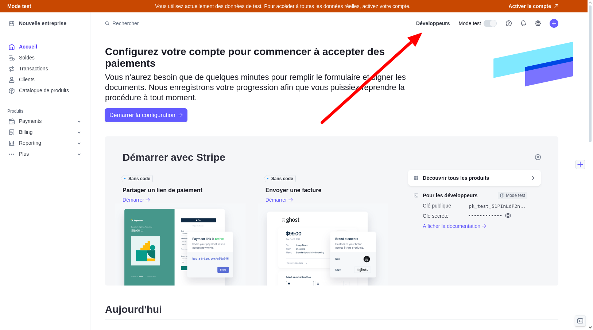
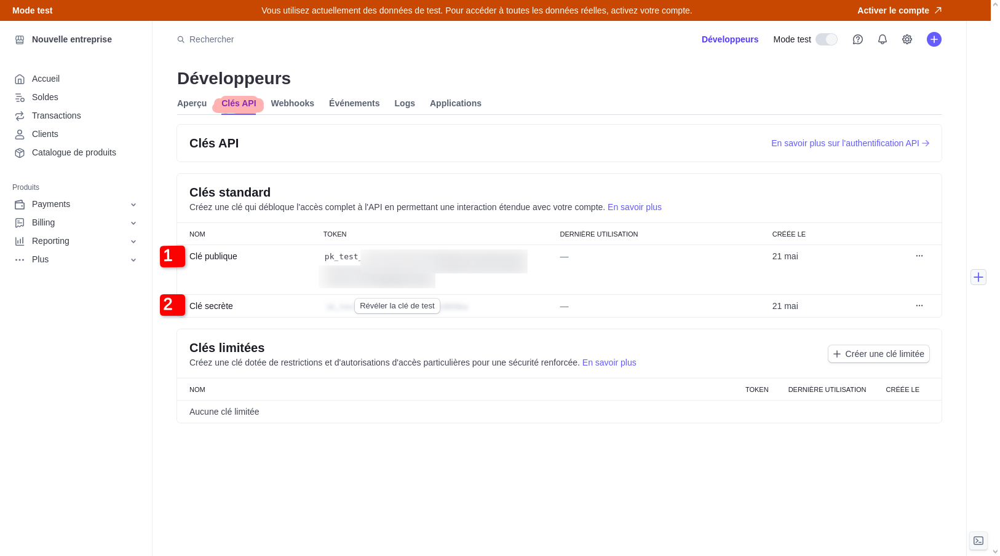

# Création d'un compte Stripe et récupération des clés d'API

## Créer un compte Stripe

Pour commencer à utiliser Stripe, vous devez créer un compte en fournissant certaines informations personnelles.

### Étapes pour l'inscription :

1. Rendez-vous sur [Stripe.com](https://stripe.com) et cliquez sur `Commencer`.
2. Remplissez le formulaire d'inscription avec les informations suivantes :
   

• **E-mail :** Votre adresse e-mail pour les communications.

• **Nom complet :** Votre nom tel qu'il apparaîtra sur le compte.

• **Pays :** Le pays où vous opérez ou résidez.

• **Mot de passe :** Un mot de passe fort pour sécuriser votre compte.

3. Après avoir rempli les champs requis, un **e-mail de vérification** est envoyé à l'adresse fournie.
4. Ouvrez l'e-mail reçu et cliquez sur le **lien de confirmation** pour activer votre compte Stripe.

Une fois votre compte activé, vous pouvez accéder à votre tableau de bord Stripe et commencer à configurer vos méthodes de paiement.

## Récupérer vos clés d'API

Les clés d'API sont nécessaires pour intégrer Stripe à votre application ou site web.

> **:information_source: Information importante :** La **clé d'API de production** ne sera disponible qu'après l'activation de votre compte Stripe. Pour les besoins de ce tutoriel, nous utiliserons la **clé d'API de test**.

### Accéder à vos clés :

1. Connectez-vous à votre [Dashboard Stripe](https://dashboard.stripe.com).
2. Dirigez-vous vers la section **Développeurs** et cliquez sur **Clés API**.
   

3. Vous trouverez ici vos clés d'API pour les environnements de **test** et de **production**.
   

### Clés d'API en mode test :

•1 **Clé publique de test :** Pour authentifier les requêtes côté client en mode test.

•2 **Clé secrète de test :** Pour authentifier les requêtes côté serveur en mode test.

### Clés d'API en mode production :

Non présentent sur la capture
• **Clé publique de production :** Pour authentifier les requêtes côté client en mode production.

• **Clé secrète de production :** Pour authentifier les requêtes côté serveur en mode production.

Pour plus d'informations, consultez la [documentation officielle de Stripe](https://stripe.com/docs).
