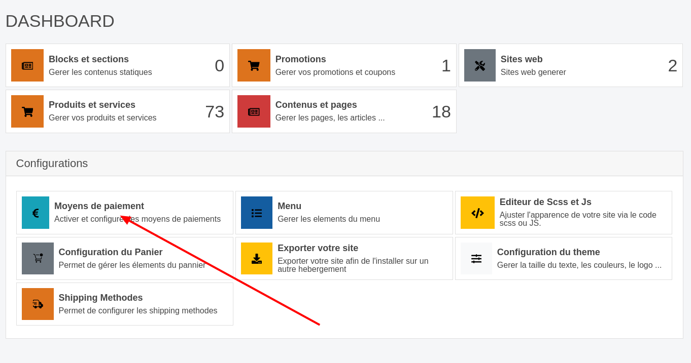
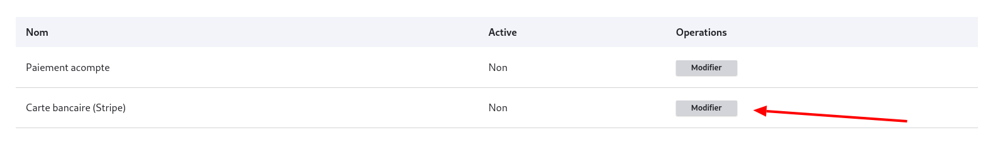
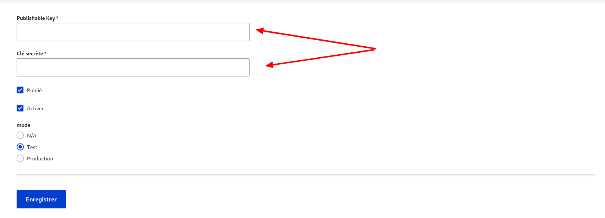

# Configuration de Stripe sur votre site wb-horizon

Cette documentation vous guidera à travers les étapes pour configurer Stripe comme moyen de paiement sur votre site wb-horizon.

## Connexion au site wb-horizon

1. **Connectez-vous** à votre site wb-horizon avec votre **compte d'administration**.

## Accès au tableau de bord wb-horizon

1. Une fois connecté, **accédez à votre dashboard** sur wb-horizon.

## Configuration des moyens de paiement sur wb-horizon

1. Dans votre tableau de bord wb-horizon, cliquez sur **moyens de paiement**.
   

2. Sur la ligne **Carte bancaire (Stripe)**, cliquez sur **modifier**.
   

## Renseignement des clés API Stripe sur wb-horizon

1. Dans le champ **Publishable Key**, saisissez la **clé publique** de Stripe.
   • Pour ce tutoriel, nous utiliserons la **clé publique de test** de Stripe.

2. Dans le champ **Clé secrète**, saisissez la **clé privée** de Stripe.

   

Assurez-vous de sauvegarder vos modifications pour activer les paiements Stripe sur votre site wb-horizon.

INFO

Tant que vous utiliserez les clés de test, il faudra laisser le mode à test. Vous pourrez faire basculer vers Production une fois que vous aurez changé les clés de test par les clés de production.

