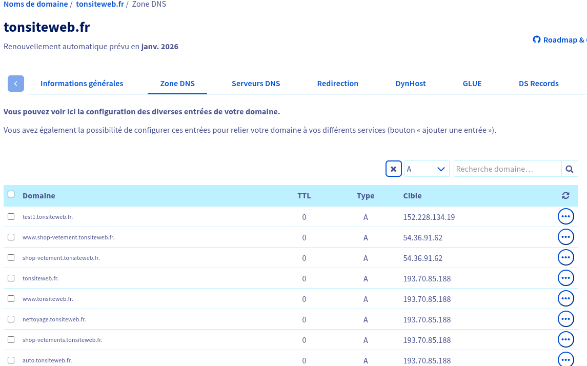
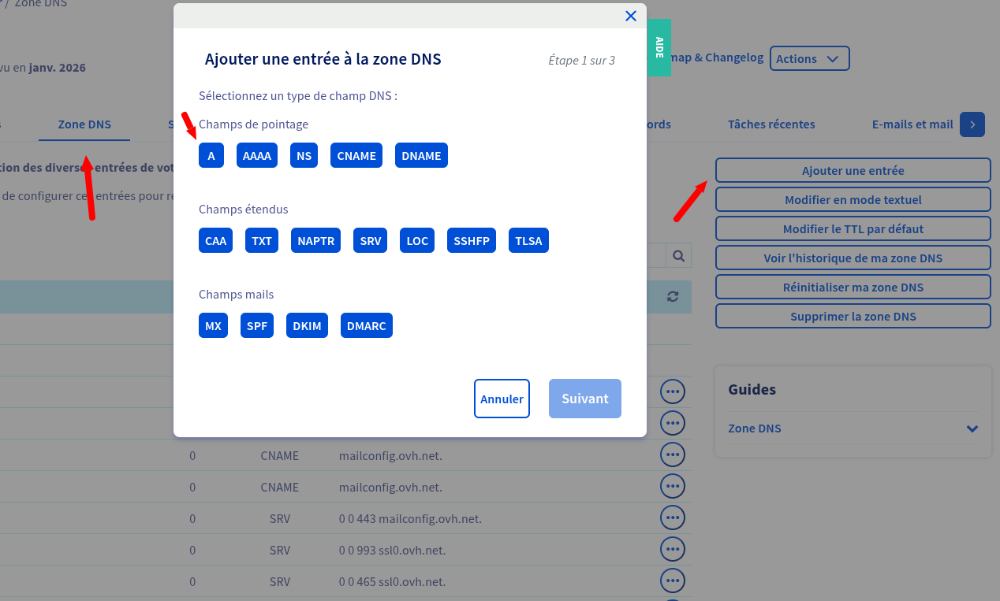
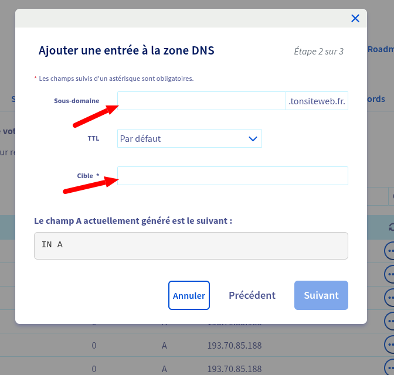
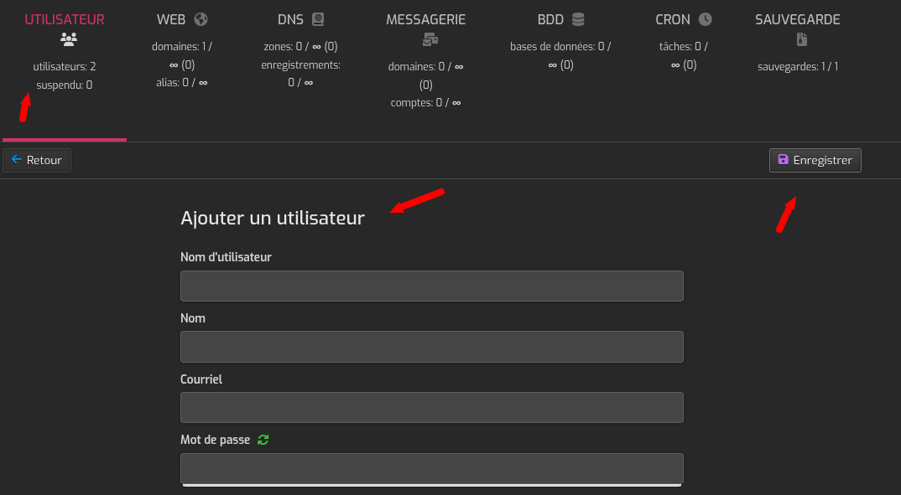
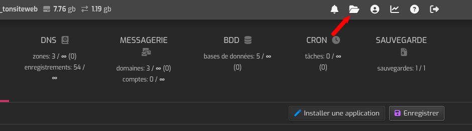
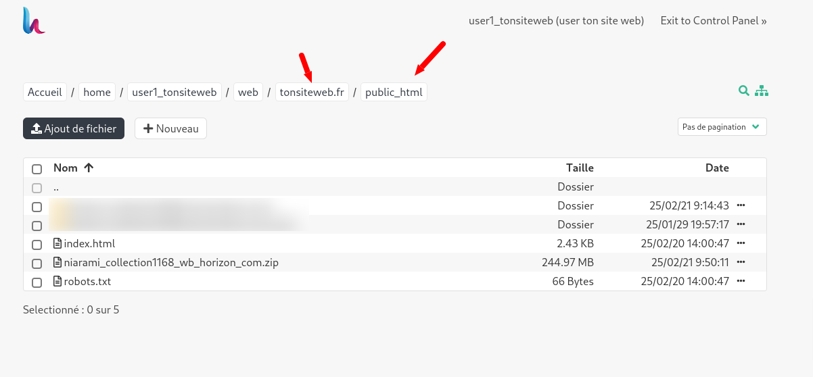
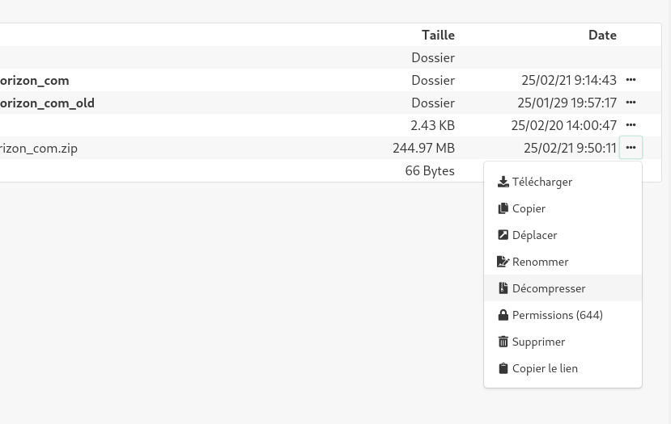
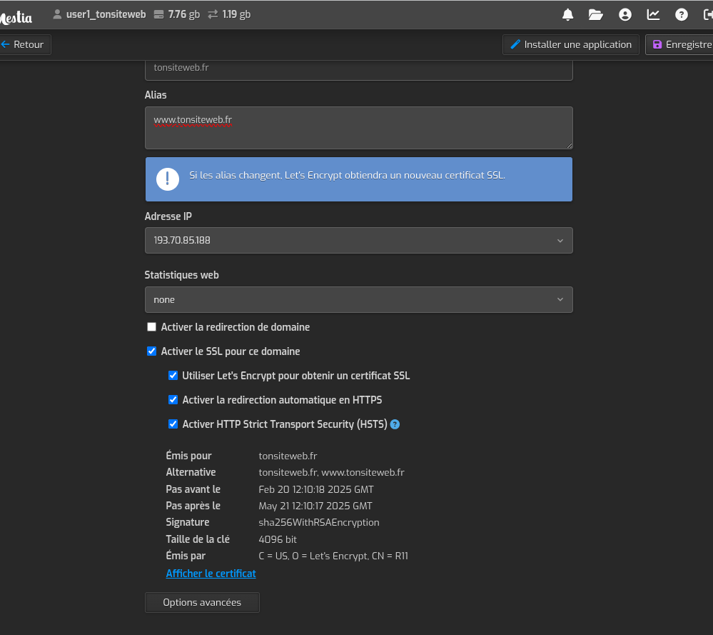
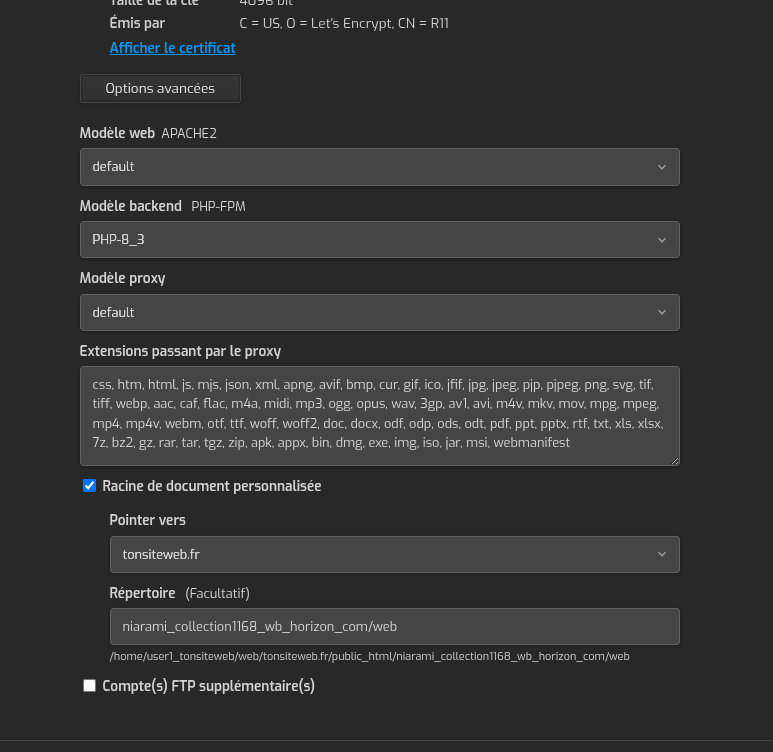

# Ajout d'un site sur un VPS

Nous utilisons hestiacp pour gerer les sites. Les noms de domaines sont geres par des registers, dans notre cas c'est OVH.

## Gerer les enregistrements DNS

Allez sur le gestionnaire de domaine et ajouter un enregistrement A pour votre domaine.
Pour notre cas on utilise OVH, connectez vous sur votre compte OVH et ajouter un enregistrement A pour votre domaine.
Allez dans `Web cloud`, puis deroulez `Nom de domaine` et selectionnez le domaine pour lequel vous voulez ajouter un enregistrement A.  
Nous commencerons par supprimer les les entres A et AAAA.  
filtrer l'affichage pour les entrées A.  

Si le domaine est par example **tonsiteweb.fr**, vous devez supprimer les 2 lignes :

- tonsiteweb.fr
- www.tonsiteweb.fr

Pour supprimer l'enregistrement **AAAA**, refais la meme operation en filtrant les entrées **AAAA**.

### ajouter une entrée A

Selectionnez `Zone DNS` puis cliquez sur le bouton `Ajouter une entre`.

Cliquez sur le bouton `A`

La `cible` de l'enregistrement A est l'adresse IP de votre VPS.
Vous devez ajouter 2 enregistrements A pour votre domaine et pour le sous-domaine www.

## Configuration sur le nouveau VPS via Hestia

Connectez vous sur le panel d'administration de hestiacp en saisissant l'adresse IP du VPS dans votre navigateur web, suivi du numero de port 8083.  
Par exemple: `http://193.70.85.188:8083/`
vous devez remplacer 193.70.85.188 par l'adresse IP de votre VPS.  
Saisissez les identifiants pour vous connecter.

#### Ajouter un utilisateur

Cliquer sur le menu utilisateur puis sur le bouton `Ajouter un utilisateur`.

Remplacer les valeurs des champs Nom d'utilisateur,Nom, Mot de passe et Email par les valeurs correspondantes puis cliquer sur le bouton `Enregistrer`.
Deconnectez vous et connectez vous avec les identifiants de l'utilisateur que vous venez de creer.

#### Ajouter un domaine

Cliquer sur ajouter un domaine.

Dans le champs domaine : mettre votre nom de domaine  
Cocher la case `Activer le SSL pour ce domaine`.  
Cocher egalement les cases `Utiliser Let's Encrypt pour obtenir un certificat SSL`, `Activer la redirection automatique en HTTPS` et `Activer HTTP Strict Transport Security (HSTS)`

#### Ajouter une base de donnée

Cliquer sur `Bases de données` puis sur le bouton `Ajouter une base de données`.

Remplacer les valeurs des champs Nom de la base de données, Nom d'utilisateur, Mot de passe par les valeurs correspondantes puis cliquer sur le bouton `Enregistrer`.

#### Importer un site web

Cliquer sur l'icone du dossier :

Acceder au dossier public_html puis cliquer sur le bouton `Importer`.

Cliquer sur le bouton `Ajouter un fichier` pour selectionner le fichier zip de votre site web puis cliquer sur le bouton `Importer`.

#### Dezipper le fichier

Selectionnner les 3 points à la fin du fichiers puis cliquer sur `Décompresser`.

#### Mofifier le dossier racine de votre domaine

cliquez sur domaine, ensuite cliquez sur le domaine à modifier.

cliquez sur `Options advances` puis dans le champs `Dossier racine` mettre le nom du dossier ou se trouve votre site web.

> **NB:** Remplacer `niarami_collection1168_wb_horizon_com` par le nom de votre dossier décompressé.

Le champs `Modèle backend PHP-FPM` doit etre sur `PHP-8_3`

---

Et voila, vous pouvez installer votre site en allant sur votre nom de domaine.
