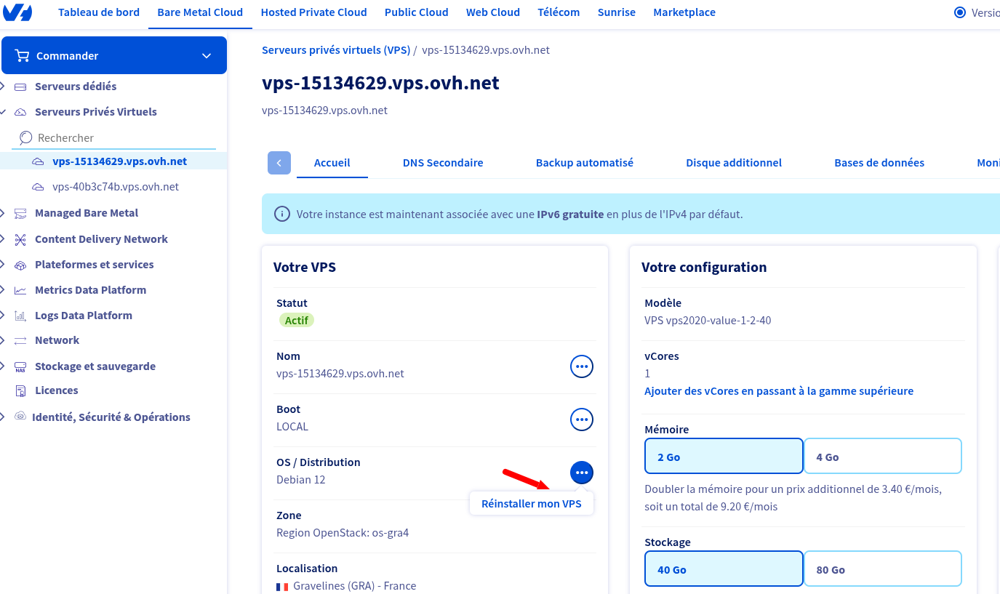

# Re-initiliser un vps

Vous pouvez tout supprimer sur un serveur VPS et le réinitialiser en suivant les étapes ci-dessous:

- Connectez vous sur OVH
- Allez dans le menu `Bare meta cloud` puis derouler `Serveurs privés virtuels` et selectionnez le serveur à réinitialiser.
- Cliquez sur `Ré-installation le serveur`.
- Confirmez la Ré-installation en cliquant sur le bouton `Confirmer`.

Vous allez recevoir un mail avec les informations necessaire pour vous connectez.
